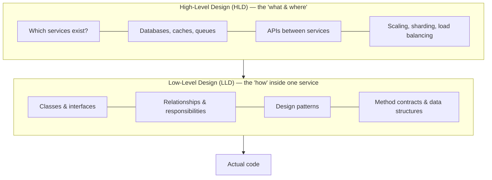
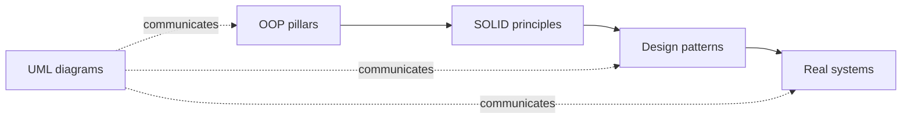

# 01 — What is Low-Level Design (LLD)?

> **In one line:** LLD is the blueprint of *how* the classes, objects, and their interactions inside a single service/module are organized so the code is **correct, readable, extensible, and testable**.

---

## 1. The 10,000-ft view: where LLD sits

When you build software, design happens at two altitudes:



- **HLD (High-Level Design)** answers *"What are the moving boxes and how do they talk?"* — services, databases, message queues, load balancers, the network between them. It's about **architecture and scale**.
- **LLD (Low-Level Design)** zooms into **one box** and answers *"How is the code inside organized?"* — which classes exist, who owns what, which interfaces decouple what, which design patterns apply.

> **Analogy.** HLD is the *city plan*: where the hospital, the power station, and the roads go. LLD is the *architectural blueprint of one building*: where the rooms, doors, plumbing, and load-bearing walls go. You need both, but they're different drawings at different zoom levels.

---

## 2. HLD vs LLD, side by side

| Aspect | High-Level Design | Low-Level Design |
|---|---|---|
| Scope | The whole system | One service / module / feature |
| Vocabulary | Services, DB, cache, queue, CDN, LB | Class, interface, object, method, pattern |
| Key question | Will it **scale & stay available**? | Will the code stay **clean & extensible**? |
| Typical diagram | Architecture / deployment diagram | **Class** & **sequence** diagrams |
| Failure looks like | Outages, latency, data loss | Spaghetti code, ripple bugs, "can't add feature X" |
| Interview format | "Design Instagram" (whiteboard, capacity math) | "Design a parking lot" (write actual classes) |

Both matter. This course is entirely about the **second column**.

---

## 3. What is *in* an LLD deliverable?

When someone says *"give me the LLD,"* they expect some subset of:

1. **A class model** — the classes/interfaces, their fields and methods, and how they relate (inheritance, composition, association). Usually a **UML class diagram**.
2. **Interaction flows** — how objects collaborate to satisfy a use-case, usually a **UML sequence diagram** ("user books a seat" → which objects call which methods, in what order).
3. **Responsibilities & contracts** — what each class is *responsible for* (and, just as important, what it is *not*), and the pre/post-conditions of key methods.
4. **Applied design patterns** — *"We use **Strategy** for pricing, **Observer** for notifications, **State** for the booking lifecycle,"* with the reasoning.
5. **Key data structures & algorithms** — e.g. *"seats are a `HashMap<SeatId, SeatState>`; we lock a seat with a compare-and-set to avoid double-booking."*
6. **Extensibility notes** — *"to add a new payment method, implement `PaymentStrategy`; nothing else changes."*

You don't always produce all six formally — but a good engineer can produce any of them on demand.

---

## 4. What does "good" LLD optimize for?

LLD is the craft of arranging code so that these properties hold:

- **Correctness** — it does the right thing, including edge cases (double-booking, payment failure, concurrent access).
- **Readability** — a new teammate understands a class without reading the whole codebase.
- **Maintainability** — a bug fix touches *one* place, not twenty.
- **Extensibility** — new features slot in by *adding* code, not *rewriting* existing code (this is the Open/Closed Principle, section 05).
- **Testability** — you can unit-test a class in isolation because its dependencies are injected, not hard-wired.
- **Reusability** — well-separated pieces get reused instead of copy-pasted.

Notice that **none** of these is "runs fast" or "scales to a billion users" — those are HLD/performance concerns. LLD is about the *health of the code itself*.

---

## 5. The mental model this course builds

Everything downstream is a tool in service of the properties above:



1. **OOP** gives you the raw materials — encapsulation, abstraction, inheritance, polymorphism.
2. **SOLID** gives you the principles for *arranging* those materials well.
3. **Design patterns** are *named, reusable solutions* to recurring problems, built on OOP + SOLID.
4. **UML** is how you *communicate* the design before/while you code it.
5. **Real systems** are where you combine all of the above under real requirements.

---

## 6. A tiny taste

Suppose you're asked to compute the price of a ride. A first instinct:

```cpp
double price(string type) {
    if (type == "normal") return base();
    else if (type == "premium") return base() * 1.5;
    else if (type == "pool")   return base() * 0.8;
    // ... every new ride type edits this function forever
}
```

LLD says: *that `if/else` will grow without bound and every edit risks breaking the others.* The **Strategy** pattern replaces it with one small class per ride type, and adding a new type means **adding a class, touching nothing else**. You'll learn exactly how and when in section 06 — but that instinct ("this `if/else` is a design smell") **is** low-level design thinking.

---

## 7. When do you actually do LLD?

- **Before coding a non-trivial feature** — sketch the classes and one sequence diagram first.
- **In code review** — "this class is doing three jobs; split it."
- **In interviews** — the *machine-coding / LLD round* asks you to design and often code a system (parking lot, splitwise, BookMyShow) in 60–90 minutes.
- **Continuously** — every time you choose where a method belongs, you're doing LLD.

---

## Key takeaways

- **LLD = how the code inside one service/module is structured**; HLD = how services fit together at scale.
- A good LLD optimizes for **correctness, readability, maintainability, extensibility, testability, reusability** — not raw speed.
- The toolchain is **OOP → SOLID → Patterns**, communicated with **UML**, and proven on **real systems**.

➡️ Next: **[02 — Why LLD? (and what happens without it)]**
