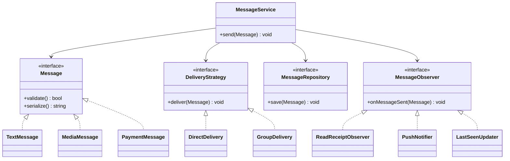
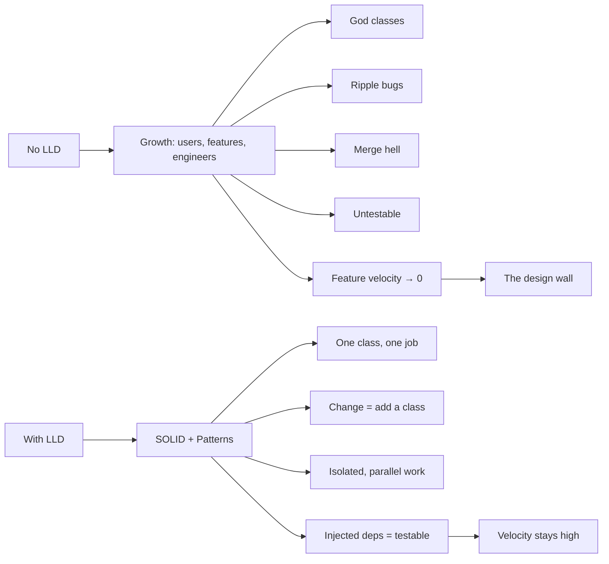

# 02 — Why LLD? (and what happens without it)

Section 01 defined LLD. This one makes you *feel* why it matters, by building a product **without** any design and watching it collapse under its own success — then showing how each LLD tool would have prevented the collapse.

We'll build **WhatsApp**. 🟢

---

## Act 1 — "It's just a chat app." (Week 1)

The requirement is tiny: *let user A send a text message to user B.* A pragmatic engineer writes one class that does everything:

```cpp
// The entire app, version 1. Ships Friday. Everyone's happy.
class ChatApp {
public:
    void sendMessage(string from, string to, string text) {
        // validate
        if (text.empty()) return;
        // store in DB
        db.insert("messages", from, to, text);
        // push over the socket
        socket.send(to, text);
        // log
        cout << from << " -> " << to << ": " << text << "\n";
    }
};
```

It works. It ships. **There is nothing wrong with this code for the requirement it has.** Premature design would be over-engineering. LLD pain is a *function of growth* — so let's grow.

---

## Act 2 — Growth of features (Month 3)

Product wants: **group chats, image/video messages, read receipts ("blue ticks"), and online/last-seen status.** Each one, added the fastest way, lands inside `ChatApp`:

```cpp
class ChatApp {
public:
    void sendMessage(string from, string to, string text, string type,
                     bool isGroup, vector<string> groupMembers,
                     string mediaUrl, bool needsReadReceipt /* …and growing */) {

        if (type == "text") {
            if (text.empty()) return;
        } else if (type == "image" || type == "video") {
            if (mediaUrl.empty()) return;
            if (!virusScan(mediaUrl)) return;          // added for media
            mediaUrl = compressAndUpload(mediaUrl);     // added for media
        } else if (type == "audio") {
            /* ... */
        }

        if (isGroup) {
            for (auto& m : groupMembers) {
                db.insert("messages", from, m, text);
                socket.send(m, text);
                if (needsReadReceipt) markUnread(from, m);   // blue ticks
            }
        } else {
            db.insert("messages", from, to, text);
            socket.send(to, text);
            if (needsReadReceipt) markUnread(from, to);
        }

        updateLastSeen(from);                            // status feature
        // ... logging, analytics, push-notification, encryption all pile in here too
    }
};
```

That method signature is now a horror, and the body is a maze of `if/else`. This is the **God Class** anti-pattern: one class that knows everything and does everything. Symptoms appear fast:

- **It's unreadable.** A new hire opening `sendMessage` has to understand media handling, group fan-out, receipts, and status *all at once* just to fix a typo in text validation.
- **Every feature is a parameter.** The signature grows forever; callers pass `""`, `false`, `{}` for the parts they don't use.

---

## Act 3 — Growth of users → growth of *engineers* (Month 9)

Now there are 12 engineers, and the real damage of no-LLD shows up. It's not about CPU — it's about **humans editing the same code**.

### Pain #1 — Ripple-effect bugs (the change you didn't mean to make)

Someone tweaks media compression. They edit `sendMessage`. They ship. **Text messages break in group chats** — because the media branch shared a variable with the group branch. The blast radius of every change is the *entire* class. Nobody can reason about "if I change X, what else breaks?" because **everything is coupled to everything**.

### Pain #2 — Merge hell

Three engineers add three features (stickers, polls, disappearing messages) in the same sprint. All three edit `sendMessage`. Their git merges conflict on the *same 200-line method*. Hours are lost reconciling edits, and the reconciliation itself introduces bugs.

### Pain #3 — Impossible to test

You want to unit-test "does an empty text get rejected?" But to construct `ChatApp` you need a real `db` and a real `socket`. The validation logic is **welded** to the database and the network. So nobody writes tests, so regressions ship freely.

### Pain #4 — Can't add a feature without fear

Product asks for a **new payment-message type** (WhatsApp Pay). The honest estimate is *"two days to build it, three more to make sure we didn't break the other 9 message types."* Velocity has collapsed. The codebase actively **resists** change. This is the real tax of skipping LLD: **the cost of every future feature goes up forever.**

> **Scaling note.** People assume "scale" means servers. The first wall you hit when you scale a *product* is almost always this **design wall**, not a hardware wall. More users → more features → more engineers → and an undesigned codebase grinds the whole team to a halt long before the database does.

---

## Act 4 — How LLD dissolves each pain

Here's the same system, designed. We don't add magic — we apply the exact tools the rest of this course teaches. Watch each earlier pain disappear.



| The pain (no LLD) | The tool | Why it's gone |
|---|---|---|
| `if (type == ...)` for every message kind | **Polymorphism** + **Factory** (a `Message` interface; `TextMessage`, `MediaMessage`, `PaymentMessage`) | Adding WhatsApp Pay = add **one new class**. `MessageService` doesn't change. (Open/Closed) |
| `if (isGroup)` fan-out logic mixed in | **Strategy** (`DirectDelivery` vs `GroupDelivery`) | Delivery is swappable and isolated; a broadcast channel is just a third strategy. |
| Read-receipts, push, last-seen all crammed in `send` | **Observer** | Each side-effect is its own observer. Adding analytics = add an observer; `send` is untouched. |
| Can't test without a real DB/socket | **Dependency Inversion** (depend on `MessageRepository` & socket *interfaces*) | In a test you pass a fake repo. Validation is now testable in isolation. |
| God Class doing everything | **Single Responsibility** | Each class has *one* reason to change, so a change touches *one* file. |
| Merge hell on one 200-line method | All of the above | Three engineers now edit three *different* files. No conflicts. |

The redesigned `send` becomes boring — which is the goal:

```cpp
void MessageService::send(std::unique_ptr<Message> msg) {
    if (!msg->validate()) return;          // each Message type validates itself
    repository_->save(*msg);               // depends on an interface, not a concrete DB
    deliveryStrategy_->deliver(*msg);      // direct or group — swappable
    for (auto* obs : observers_)           // receipts, push, last-seen, analytics…
        obs->onMessageSent(*msg);
}
```

Every branch that used to live here now lives behind a polymorphic boundary. The method stopped being a battleground.

---

## The one-slide summary



---

## So… should you always do heavy LLD?

No. **LLD is insurance against change, and insurance has a cost.** Version 1 of the chat app was *correct* to be simple. The skill is recognizing the inflection point — when a class starts attracting `if/else` for every new feature, when a method's signature won't stop growing, when two people keep colliding in the same file. That's the moment to introduce the right abstraction, and *not a moment before* (premature abstraction is its own anti-pattern, covered in section 05).

The rest of this course teaches you to **see those inflection points** and to **know exactly which tool** removes the pain.

---

## Key takeaways

- Bad design doesn't hurt on day one; it hurts when the product **grows** (features, users, engineers).
- The first wall a growing product hits is usually a **design wall**, not a hardware wall.
- The concrete symptoms — **god classes, ripple bugs, merge hell, untestability, dying velocity** — each map to a specific LLD remedy (SRP, OCP, Strategy, Observer, DIP).
- LLD is *insurance against change*: apply it where change is likely, skip it where it isn't.

➡️ Next: **[03 — OOP Fundamentals]**
