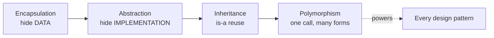

# 03 — OOP Fundamentals

Object-Oriented Programming is the raw material of LLD. SOLID and every design pattern are built on these four pillars. Each is shown with **runnable C++ and Java** in real domains (banking, payments, payroll, notifications) — no `Animal`/`Dog`/`Cat`.

| Pillar | One-liner | Chapter |
|---|---|---|
| **Encapsulation** | Bundle data with the methods that guard it; hide internals. | [Encapsulation](Encapsulation/Notes.md) |
| **Abstraction** | Expose *what* it does; hide *how*. Program to interfaces. | [Abstraction](Abstraction/Notes.md) |
| **Inheritance** | An "is-a" relationship; reuse + specialize a base class. | [Inheritance](Inheritance/Notes.md) |
| **Polymorphism** | One call, many forms — the right behaviour for the real type. | [Polymorphism](Polymorphism/Notes.md) |

Each chapter has a `C++ Code/`, a `Java Code/`, and its own `Notes.md`.

---

## How the four pillars relate

- **Encapsulation** protects *state* — private data + guarding methods, so invariants can't break.
- **Abstraction** hides *implementation* — program to an interface, so callers don't change when details do.
- **Inheritance** models *is-a* and enables specialization — but prefer **composition** for mere code reuse.
- **Polymorphism** (especially *dynamic* / `virtual`) lets one piece of code drive many types. **Almost every design pattern in this course is just disciplined dynamic polymorphism** — a base interface plus interchangeable concrete classes.

> **Why every polymorphic base needs a `virtual` destructor (C++):** deleting a derived object through a base pointer with a non-virtual destructor skips the derived destructor (leaks / undefined behaviour). Every polymorphic base here declares `virtual ~Base() {}`. (Java has no destructors — the garbage collector handles it.)

## Encapsulation vs Abstraction (the common mix-up)
- *Encapsulation* hides **data** to protect state (the private `balancePaise`).
- *Abstraction* hides **implementation** behind an interface (the `PaymentMethod`).
They reinforce each other but solve different problems.

## Key takeaways
- The four pillars are the vocabulary for everything that follows (SOLID, patterns, systems).
- Hide what varies; expose a small, safe surface.
- Inherit for **is-a**, compose for **has-a**.
- Dynamic polymorphism is the engine under the design patterns in section 06.

➡️ Next: **[04 — UML Diagrams](../04%20-%20UML%20Diagrams/Notes.md)**
