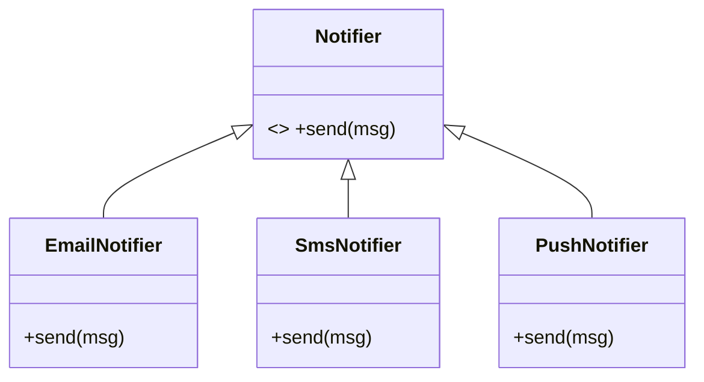

# Polymorphism

> **Section 03 — OOP Fundamentals** · Code: [C++](C++%20Code/polymorphism.cpp) · [Java](Java%20Code/Polymorphism.java)

"Polymorphism" = **many forms**. The *same* call does the right thing for the actual object behind it. It is the pillar that powers almost every design pattern later in this course.

---

## Two flavours

| Flavour | Bound at | C++ mechanism | Java mechanism |
|---|---|---|---|
| **Static** (compile-time) | compile time | function overloading, templates | method overloading, generics |
| **Dynamic** (run-time) | run time | `virtual` functions + base pointer | abstract class / interface + reference |

**Dynamic** polymorphism is the one that matters for design: you write code **once** against a base type, and it works for every present *and future* subclass.

## The example

A `Notifier` base type declares an abstract `send()`. `Email`, `Sms` and `Push` each override it. `broadcast()` is written once against `Notifier` and never changes when you add a new channel — the Open/Closed Principle in action (section 05).



## Key points (C++)
- Abstract method = `virtual void send(...) = 0;` — makes the class abstract and forces every child to implement it.
- Always give a polymorphic base a **virtual destructor** (`virtual ~Notifier() {}`) so `delete basePtr;` runs the correct subclass destructor.
- This single-file demo uses raw `new`/`delete`; the virtual destructor makes that cleanup safe.

## Java differences
- `abstract class` + `abstract void send(...)`; overrides are implicit (no `virtual` keyword).
- No manual memory management — the garbage collector reclaims objects.
- Cosmetic only: C++ `to_string(3.14)` prints `3.140000`, Java prints `3.14`.

## How to run

**C++** (g++ 6.3+, C++14)
```powershell
cd "03 - OOP Fundamentals/Polymorphism/C++ Code"
g++ -std=c++14 polymorphism.cpp -o polymorphism.exe ; .\polymorphism.exe
```

**Java** (JDK 17+)
```powershell
cd "03 - OOP Fundamentals/Polymorphism/Java Code"
javac Polymorphism.java ; java Polymorphism
```

### Expected output
```
Static polymorphism (overloading):
  int(42)
  double(3.14)
  string("hello")
  maxOf(3, 9)     = 9
  maxOf(2.5, 1.5) = 2.5

Dynamic polymorphism (virtual dispatch):
  [EMAIL] Your OTP is 4827
  [SMS]   Your OTP is 4827
  [PUSH]  Your OTP is 4827
```
