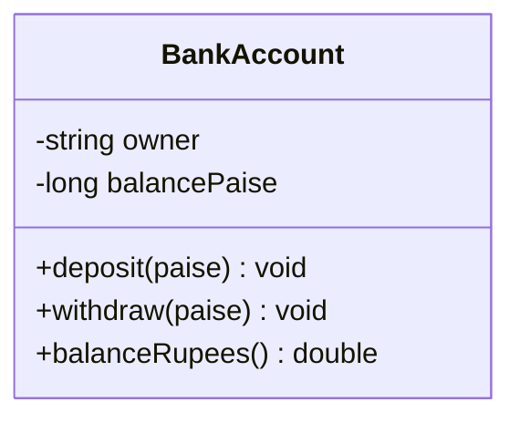
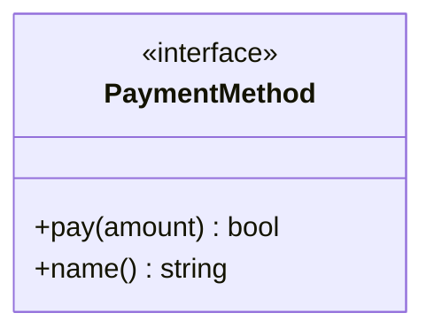
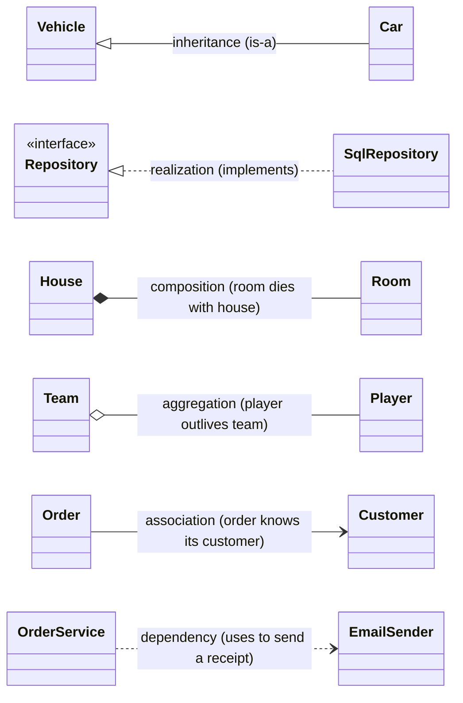
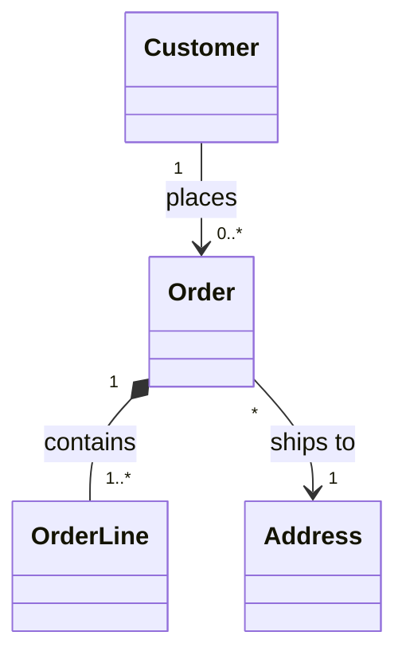
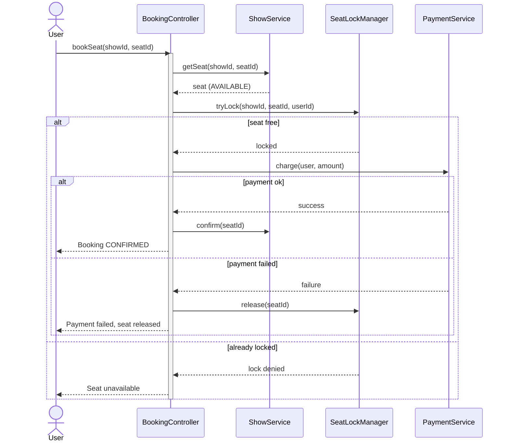
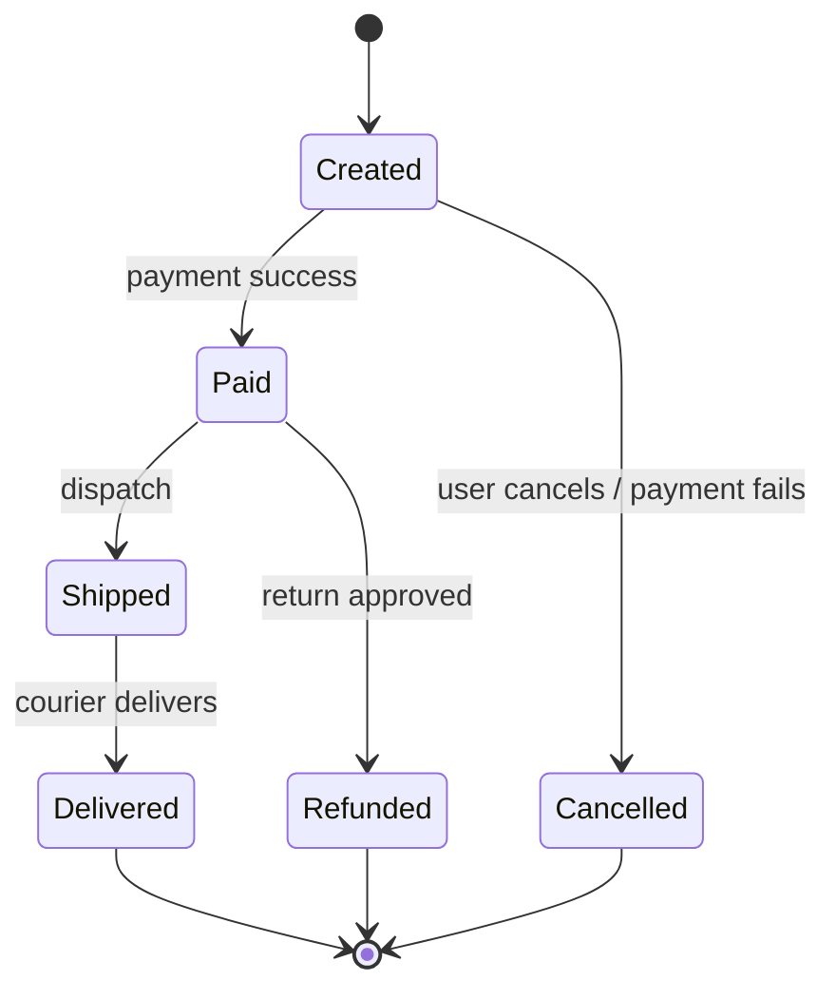
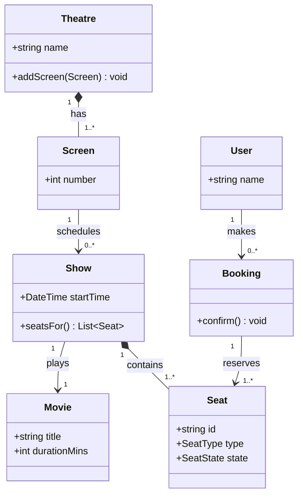

# 04 — UML Diagrams

UML (Unified Modeling Language) is how engineers **draw a design before (and while) coding it**. In LLD you mainly need three diagrams:

1. **Class diagram** — the static structure: classes and how they relate. (Most important.)
2. **Sequence diagram** — the dynamic flow: which object calls which, in what order.
3. **State diagram** — the lifecycle: the states an object moves through.

---

## Part A — Class diagrams

### A class

A class box has three compartments: **name**, **attributes**, **operations**. Visibility markers:

| Symbol | Meaning |
|---|---|
| `+` | public |
| `-` | private |
| `#` | protected |
| `~` | package / internal |

An **interface** (abstract type) is marked with the `<<interface>>` stereotype:

### The six relationships (know these cold)

This is the heart of reading/writing class diagrams. Each has a distinct arrow:

| Relationship | Reads as | Mermaid arrow | Ownership / strength |
|---|---|---|---|
| **Inheritance** (generalization) | "is-a" | `Base <|-- Derived` | solid line, hollow triangle |
| **Realization** (implements) | "implements interface" | `Iface <|.. Impl` | dashed line, hollow triangle |
| **Composition** | "owns / part-of (dies with)" | `Whole *-- Part` | strong — part can't outlive whole |
| **Aggregation** | "has-a (shared)" | `Whole o-- Part` | weak — part lives independently |
| **Association** | "knows / uses long-term" | `A --> B` | a persistent link/reference |
| **Dependency** | "uses temporarily" | `A ..> B` | transient (a parameter, a local) |

**Composition vs Aggregation — the one that trips everyone up:**
- **Composition** (`*--`): the part is *owned*; when the whole is destroyed, the part is too. A `Room` has no meaning without its `House`. In C++ this is usually a **by-value member** or a `unique_ptr`.
- **Aggregation** (`o--`): the part is *referenced* but lives on its own. A `Player` exists before and after being on a `Team`. In C++ this is usually a **raw pointer / reference / `shared_ptr`** to something owned elsewhere.

### Multiplicity

Numbers on the ends say *how many*:

| Notation | Meaning |
|---|---|
| `1` | exactly one |
| `0..1` | zero or one (optional) |
| `*` or `0..*` | zero or more |
| `1..*` | one or more |

Read it as: *one Customer places zero-or-more Orders; each Order is composed of one-or-more OrderLines; many Orders ship to one Address.*

---

## Part B — Sequence diagrams

A sequence diagram shows **objects talking over time**. Time flows **downward**; each participant has a vertical **lifeline**; arrows are **messages**.

| Element | Mermaid | Meaning |
|---|---|---|
| Synchronous call | `A->>B: method()` | A calls B and waits |
| Return | `B-->>A: result` | B returns to A (dashed) |
| Self-call | `A->>A: helper()` | object calls itself |
| Activation bar | `activate B` / `deactivate B` | B is doing work |
| Alternative | `alt / else / end` | a branch (if/else) |
| Loop | `loop ... end` | repetition |

Here's *"a user books a movie seat"* — the exact flow you'll implement in the BookMyShow system (section 07):

Notice how the diagram makes the **edge cases explicit** (seat already locked, payment failure → release the lock). That's the real value: a sequence diagram forces you to think through failure paths *before* you write the bug.

---

## Part C — State diagrams

A state diagram shows the **lifecycle** of one object: the states it can be in and the events that move it between them. This maps directly onto the **State pattern** (section 06).

An **Order's** lifecycle:

If you can draw this, you can implement it: each state becomes a class, each arrow becomes a method that returns the next state. Illegal transitions (e.g. `Delivered → Created`) simply don't exist — the diagram *is* the spec.

---

## Part D — A worked domain (putting it together)

Designing the **movie-booking** domain produces all three diagrams from the same nouns and verbs:

From these **nouns** (`Movie`, `Show`, `Seat`, `Booking`) you get the class diagram; from the **verb** "book a seat" you get the sequence diagram (Part B); from the **seat's lifecycle** (`Available → Locked → Booked`) you get a state diagram. This is the standard recipe:

> **Recipe:** nouns → classes/attributes; verbs → methods & sequence flows; lifecycles → state diagrams.

---

## A note on the other UML diagrams

UML has ~14 diagram types. For LLD you rarely need more than the three above, but you should *recognize* these:

- **Use-case diagram** — actors and the goals they pursue (very high level).
- **Activity diagram** — a flowchart of a process (like a sequence diagram but workflow-focused).
- **Component / Deployment diagram** — these are **HLD** tools (services, servers).

If an interviewer says "draw the design," they almost always mean a **class diagram** plus maybe **one sequence diagram** for the trickiest flow. That's what the rest of this course uses everywhere.

---

## Key takeaways

- **Class diagram** = static structure; master the **six relationships** and **multiplicity**.
- **Composition (`*--`, owned, dies-with) vs Aggregation (`o--`, shared, lives-on)** is the most-tested distinction.
- **Sequence diagram** = the dynamic call flow; use it to surface **edge/failure cases** early.
- **State diagram** = an object's lifecycle; it translates 1:1 into the **State pattern**.
- Keep diagrams in **Mermaid**, in the repo, next to the code, so they never rot.

➡️ Next: **[05 — SOLID Principles]**
