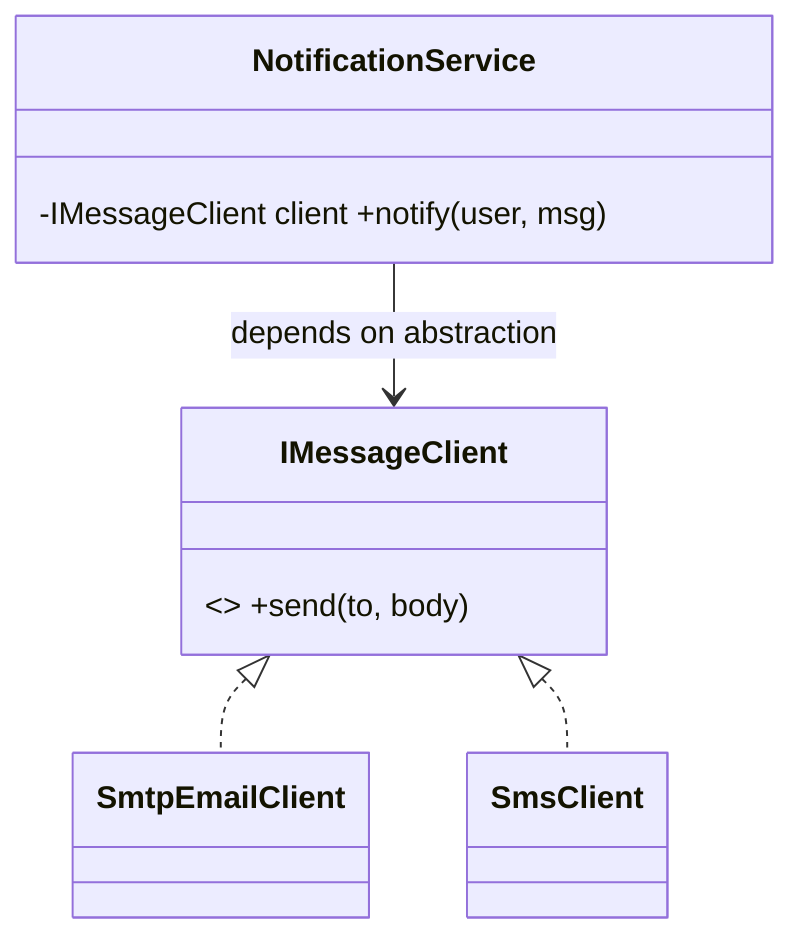

# Dependency Inversion Principle (DIP)

> **Section 05 — SOLID** · the **D** · Code: [C++](C++%20Code/) · [Java](Java%20Code/)

> *"High-level modules and low-level modules should both depend on abstractions."*

| C++ | Java | Shows |
|---|---|---|
| `violates-dip.cpp` | `ViolatesDIP.java` | service welded to a concrete `SmtpEmailClient` |
| `follows-dip.cpp` | `FollowsDIP.java` | both depend on an injected `IMessageClient` |

---

## The smell

The high-level `NotificationService` (policy) directly owns a `SmtpEmailClient` (detail). It's welded to SMTP — you can't switch to SMS, and you can't test it without sending real email.

## The fix

Both depend on an `IMessageClient` abstraction, **injected** through the constructor (this is *dependency injection*, the most common way to achieve DIP):



The dependency arrow now points **at the abstraction**, not a concrete class — the "inversion." Swapping email for SMS, or injecting a fake in a test, needs zero changes to `NotificationService`.

> **DIP vs Dependency Injection:** DIP is the *principle* (depend on abstractions). DI is the common *technique* (pass the dependency in) used to achieve it.

## How to run

**C++**
```powershell
cd "05 - SOLID Principles/Dependency Inversion Principle/C++ Code"
g++ -std=c++14 violates-dip.cpp -o violates.exe ; .\violates.exe
g++ -std=c++14 follows-dip.cpp  -o follows.exe  ; .\follows.exe
```
**Java**
```powershell
cd "05 - SOLID Principles/Dependency Inversion Principle/Java Code"
javac ViolatesDIP.java ; java ViolatesDIP
javac FollowsDIP.java  ; java FollowsDIP
```

### Expected output (`follows`)
```
  [SMTP] to aarav@mail.com: Your order shipped
  [SMS]  to +91-90000-00000: Your OTP is 4827
Same service, swapped transport - and a test could inject a fake client.
```
