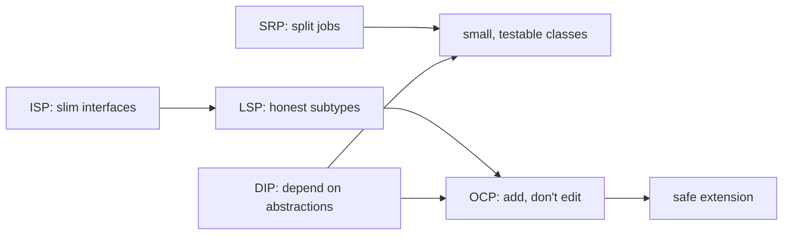

# 05 — SOLID Principles

SOLID is five principles for arranging classes so code stays **flexible and maintainable**. They're the bridge between raw OOP (section 03) and design patterns (section 06) — in fact, *most patterns are just a clever way to satisfy one or more SOLID principles.*

| Letter | Principle | One-line cure | Chapter |
|---|---|---|---|
| **S** | Single Responsibility | One class, one reason to change | [SRP](Single%20Responsibility%20Principle/Notes.md) |
| **O** | Open/Closed | Extend by adding code, not editing it | [OCP](Open%20Closed%20Principle/Notes.md) |
| **L** | Liskov Substitution | A subclass must be usable as its base | [LSP](Liskov%20Substitution%20Principle/Notes.md) |
| **I** | Interface Segregation | Many small interfaces > one fat one | [ISP](Interface%20Segregation%20Principle/Notes.md) |
| **D** | Dependency Inversion | Depend on abstractions, inject details | [DIP](Dependency%20Inversion%20Principle/Notes.md) |

Each chapter ships **two** programs per language — the **smell** (`violates-*`) right next to the **fix** (`follows-*`) — in both `C++ Code/` and `Java Code/`.

---

## Quick reference

- **S** — one class, one reason to change (watch for the word **"and"** in its description).
- **O** — extend by adding classes; kill the growing `if/else`/`switch`.
- **L** — a subclass must honour every promise its base makes (no "not supported" throws).
- **I** — slim, role-based interfaces so nobody implements methods they lack.
- **D** — depend on interfaces and **inject** the concrete detail (enables swapping + testing).

## How they reinforce each other

- **ISP** keeps interfaces honest, which makes **LSP** easy to satisfy.
- **LSP** + **DIP** are what make **OCP** actually work (you can substitute new implementations safely).
- **SRP** + **DIP** are what make code **testable** (small units, injected fakes).

> **Don't over-apply.** SOLID is insurance against *change*. Forcing five interfaces onto a 10-line script is over-engineering (recall section 02). Apply each principle where a real axis of change exists.

## Key takeaway
Most **design patterns** are named recipes for satisfying these principles — which is exactly where we go next.

➡️ Next: **[06 — Design Patterns]**
