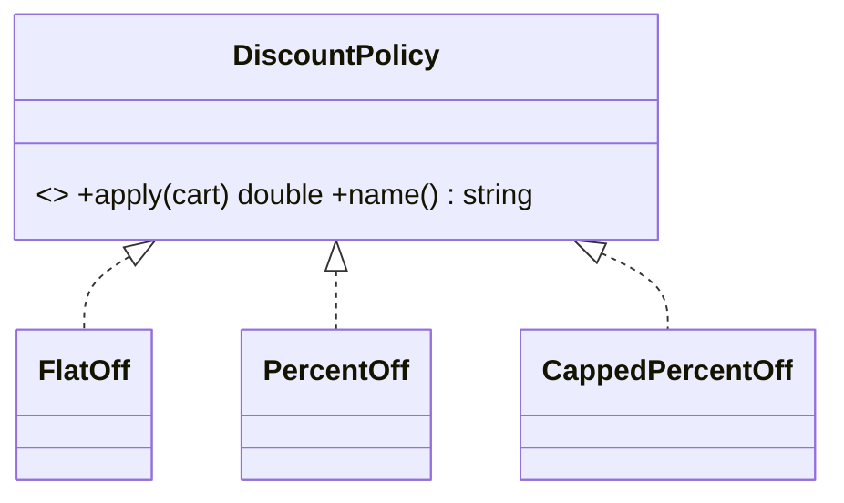

# Open/Closed Principle (OCP)

> **Section 05 — SOLID** · the **O** · Code: [C++](C++%20Code/) · [Java](Java%20Code/)

> *"Software entities should be OPEN for extension, CLOSED for modification."*
> Add new behaviour by adding new code — not by editing code that already works.

| C++ | Java | Shows |
|---|---|---|
| `violates-ocp.cpp` | `ViolatesOCP.java` | a growing `if/else` over coupon strings |
| `follows-ocp.cpp` | `FollowsOCP.java` | a `DiscountPolicy` interface (Strategy) |

---

## The smell

`finalPrice()` is a growing `if/else` over coupon strings. Every new coupon edits a function that already works — re-risking the tested branches (the "ripple bug" from section 02).

## The fix

Introduce a `DiscountPolicy` interface (this **is** the Strategy pattern). Adding `CappedPercentOff` is a **new class**; the calculator never changes again.



> **How to spot it:** a `switch`/`if-else` on a "type" string or enum that you keep coming back to edit. Replace it with polymorphism.

## How to run

**C++**
```powershell
cd "05 - SOLID Principles/Open Closed Principle/C++ Code"
g++ -std=c++14 violates-ocp.cpp -o violates.exe ; .\violates.exe
g++ -std=c++14 follows-ocp.cpp  -o follows.exe  ; .\follows.exe
```
**Java**
```powershell
cd "05 - SOLID Principles/Open Closed Principle/Java Code"
javac ViolatesOCP.java ; java ViolatesOCP
javac FollowsOCP.java  ; java FollowsOCP
```

### Expected output (`follows`)
```
Cart = Rs 1000
  Flat Rs 100  ->  Rs 900
  10% off  ->  Rs 900
  20% off (max Rs 150)  ->  Rs 850
```
