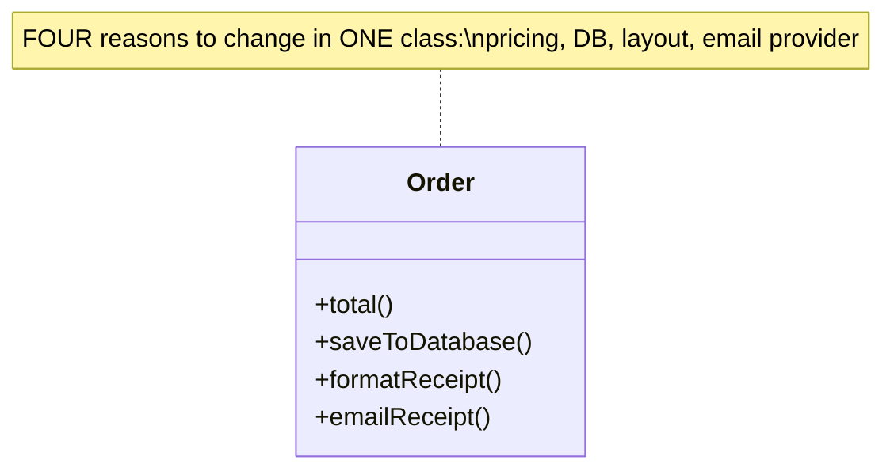
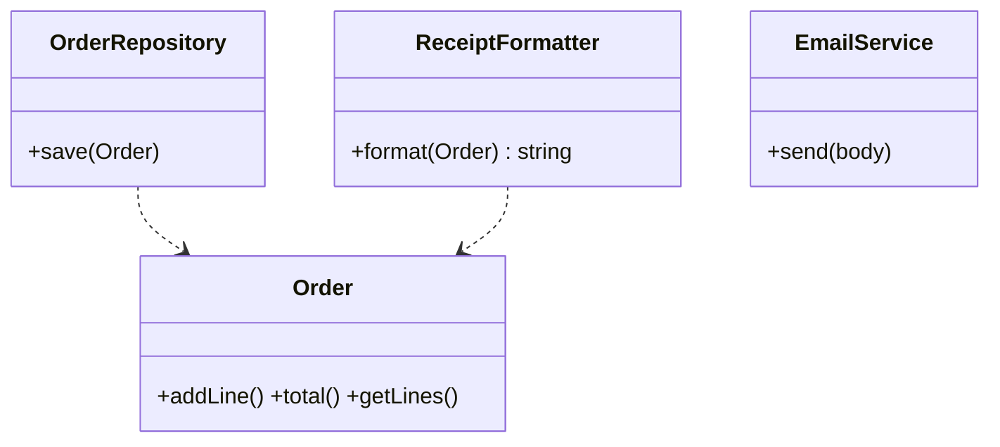

# Single Responsibility Principle (SRP)

> **Section 05 — SOLID Principles** · the **S** in SOLID · Code: [C++](C++%20Code/) · [Java](Java%20Code/)

> *"A class should have only ONE reason to change."*

Every SOLID chapter ships **two** programs — one that **violates** the principle and one that **follows** it — so you can run both and feel the difference.

| C++ | Java | Shows |
|---|---|---|
| `violates-srp.cpp` | `ViolatesSRP.java` | one "god class" with four reasons to change |
| `follows-srp.cpp` | `FollowsSRP.java` | one class per responsibility |

---

## The smell (violation)

`Order` computes the total **and** saves to a database **and** formats a receipt **and** emails the customer. Four unrelated reasons to change are welded together — editing the email format risks breaking total calculation, and none of it can be tested in isolation.



## The fix

One class per responsibility. `Order` only models the order; persistence, formatting and notification each move to their own class. Each now has exactly one reason to change and can be swapped or tested on its own.



## How to run

**C++**
```powershell
cd "05 - SOLID Principles/Single Responsibility Principle/C++ Code"
g++ -std=c++14 violates-srp.cpp -o violates.exe ; .\violates.exe
g++ -std=c++14 follows-srp.cpp  -o follows.exe  ; .\follows.exe
```

**Java**
```powershell
cd "05 - SOLID Principles/Single Responsibility Principle/Java Code"
javac ViolatesSRP.java ; java ViolatesSRP
javac FollowsSRP.java  ; java FollowsSRP
```

Both versions print the same receipt — the point isn't the output, it's **how many reasons each design has to change.**
