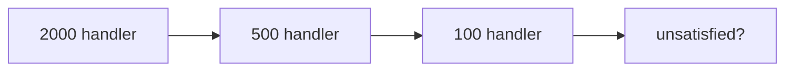

# Chain of Responsibility

> **Section 06 — Design Patterns › Behavioral** · Code: [C++](C++%20Code/example.cpp) · [Java](Java%20Code/Main.java)

**Intent:** pass a request along a chain of handlers; each handles part of it or forwards the rest. The sender doesn't know which handler finishes the job.

**Domain:** an ATM dispenses the fewest notes. The Rs 2000 handler takes as many 2000s as it can, forwards the remainder to Rs 500, then Rs 100. Adding a Rs 200 note = inserting one handler.



- Each handler holds a reference to the **next** and decides whether to forward.
- New denomination = new link; existing handlers don't change (**OCP**). Section 09 applies this to HTTP middleware (auth → rate-limit → log).

## How to run
```powershell
cd "06 - Design Patterns/Behavioral/Chain of Responsibility/C++ Code"
g++ -std=c++14 example.cpp -o example.exe ; .\example.exe
# Java: cd "../Java Code" ; javac Main.java ; java Main
```

### Expected output (identical in C++ and Java)
```
Withdraw Rs 5600:
  dispense 2 x Rs 2000
  dispense 3 x Rs 500
  dispense 1 x Rs 100
Withdraw Rs 2000:
  dispense 1 x Rs 2000
Withdraw Rs 750:
  dispense 1 x Rs 500
  dispense 2 x Rs 100
  cannot dispense remaining Rs 50
```
