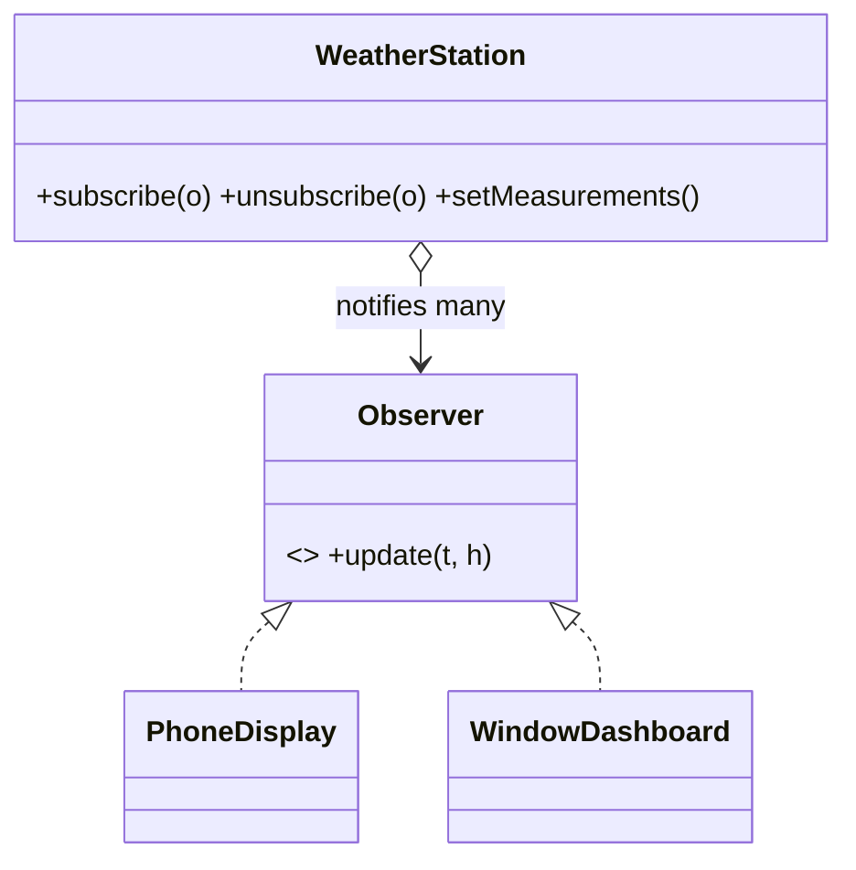

# Observer

> **Section 06 — Design Patterns › Behavioral** · Code: [C++](C++%20Code/example.cpp) · [Java](Java%20Code/Main.java)

**Intent:** define a one-to-many dependency so that when one object (the subject) changes, all its dependents (observers) are notified automatically. The subject doesn't know the concrete observer types.

**Domain:** a weather station. When a new reading arrives, every attached display updates itself. Adding a display = adding an observer; the station code never changes.



- The subject keeps a list of observers and pushes updates on change.
- (In Java the notify method is named `notifyObservers` because `Object.notifyAll()` is `final`.) Section 09 applies this to a live stock-price ticker.

## How to run
```powershell
cd "06 - Design Patterns/Behavioral/Observer/C++ Code"
g++ -std=c++14 example.cpp -o example.exe ; .\example.exe
# Java: cd "../Java Code" ; javac Main.java ; java Main
```

### Expected output
```
Reading 1:
  [Aarav's phone] 31.5C, 60% humidity
  [window dashboard] temp=31.5C
Reading 2 (Aarav closed the app -> unsubscribed):
  [window dashboard] temp=37C  (heat alert!)
```
> (Java prints `60.0` / `37.0` — display only.)
