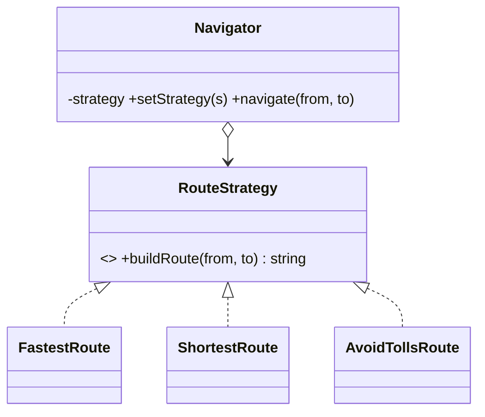

# Strategy Pattern

> **Section 06 — Design Patterns › Behavioral** · Code: [C++](C++%20Code/example.cpp) · [Java](Java%20Code/Main.java)

**Intent:** define a family of interchangeable algorithms, put each in its own class, and make them swappable at run time. The *context* delegates the varying behaviour to a strategy object instead of hard-coding it.

---

## Domain

A navigation app computes a route. *How* — **fastest**, **shortest**, or **avoid-tolls** — is a strategy the user picks at run time. The `Navigator` code stays identical; only the plugged-in strategy changes.



## Why Strategy
- The algorithm is the part that **varies** — isolate it behind an interface.
- Add a new route type = add a new class; `Navigator` never changes (**Open/Closed Principle**).
- Swap behaviour at **run time**, not compile time (the advantage over plain inheritance).

## Note on ownership (C++)
`Navigator` owns its current strategy via a raw pointer and `delete`s it in `setStrategy()` and its destructor. In the larger systems (section 07) we use smart pointers for this; here, in a small single-file demo, manual `new`/`delete` keeps the mechanics visible. Java leaves it to the garbage collector.

## How to run

**C++**
```powershell
cd "06 - Design Patterns/Behavioral/Strategy/C++ Code"
g++ -std=c++14 example.cpp -o example.exe ; .\example.exe
```

**Java**
```powershell
cd "06 - Design Patterns/Behavioral/Strategy/Java Code"
javac Main.java ; java Main
```

### Expected output
```
Fastest:
  Home -> [highway, 2 tolls] -> Office  (42 min)
Shortest:
  Home -> [city roads] -> Office  (11 km, 55 min)
Avoid tolls (swapped at run time):
  Home -> [no tolls] -> Office  (49 min)
```
