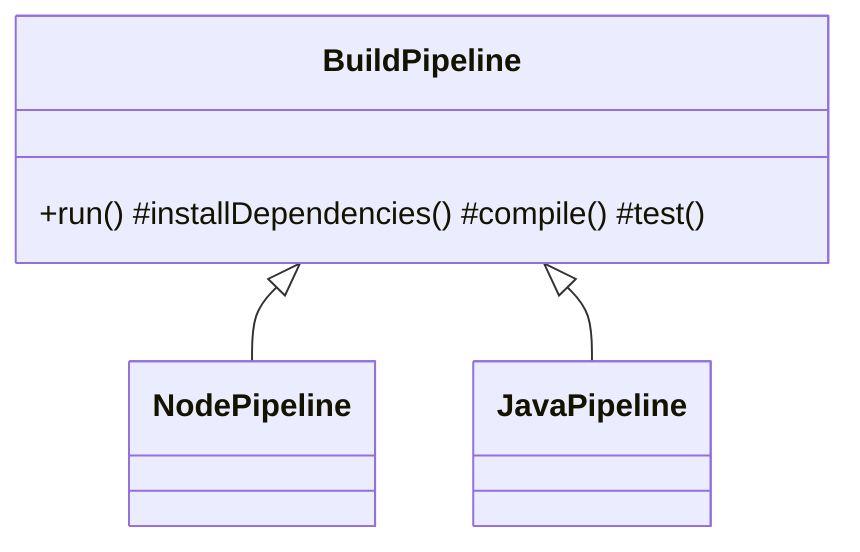

# Template Method

> **Section 06 — Design Patterns › Behavioral** · Code: [C++](C++%20Code/example.cpp) · [Java](Java%20Code/Main.java)

**Intent:** define the **skeleton** of an algorithm in a base class and let subclasses override specific **steps** without changing the overall structure. The fixed sequence lives in one place; only the varying steps are subclassed.

**Domain:** a CI build pipeline. Every build does `checkout → install deps → compile → test → (maybe) deploy`, in that order. A Node project and a Java project differ only in *how* some steps run.



- `run()` is the **template method**: a fixed skeleton (marked `final` in Java) the subclass can't reorder.
- `deployable()` is a **hook** — an optional step with a default the subclass may override.

## How to run
```powershell
cd "06 - Design Patterns/Behavioral/Template Method/C++ Code"
g++ -std=c++14 example.cpp -o example.exe ; .\example.exe
# Java: cd "../Java Code" ; javac Main.java ; java Main
```

### Expected output (identical in C++ and Java)
```
Node pipeline:
  git checkout main
  npm ci
  tsc (TypeScript -> JS)
  jest
  deploy artifact to registry
  pipeline complete
Java pipeline:
  git checkout main
  mvn dependency:resolve
  javac
  junit
  pipeline complete
```
