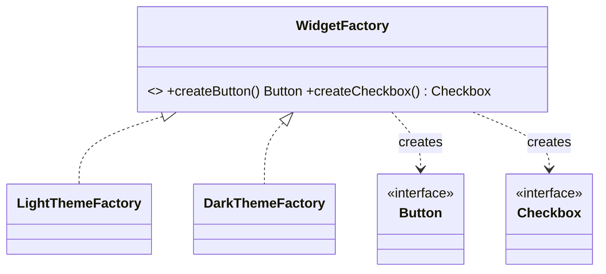

# Abstract Factory

> **Section 06 — Design Patterns › Creational** · Code: [C++](C++%20Code/example.cpp) · [Java](Java%20Code/Main.java)

**Intent:** create **families** of related objects without specifying their concrete classes, guaranteeing the products in a family match.

**Domain:** a cross-platform UI toolkit. A "Light" theme and a "Dark" theme each produce a matching `Button` + `Checkbox`. The client builds a form via a factory and is guaranteed a consistent look — you can't mix a light button with a dark checkbox.



- **Factory Method** makes one product; **Abstract Factory** makes a consistent **family**.
- Adding a "High-Contrast" theme = one new factory + its product variants; client code never changes.

## How to run
```powershell
cd "06 - Design Patterns/Creational/Abstract Factory/C++ Code"
g++ -std=c++14 example.cpp -o example.exe ; .\example.exe
```
```powershell
cd "06 - Design Patterns/Creational/Abstract Factory/Java Code"
javac Main.java ; java Main
```

### Expected output (identical in C++ and Java)
```
Light theme:
  [x] Remember me  (light)
  [ Submit ]  (white bg, dark text)
Dark theme:
  [x] Remember me  (dark)
  [ Submit ]  (dark bg, light text)
```
