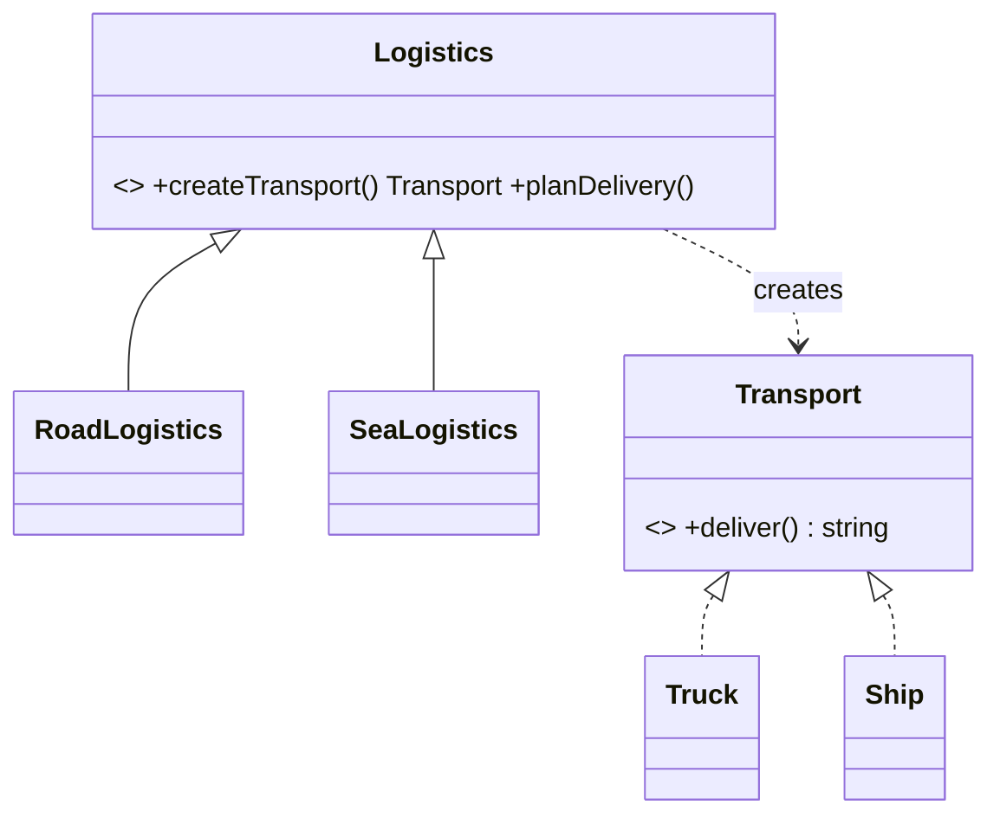

# Factory Method

> **Section 06 — Design Patterns › Creational** · Code: [C++](C++%20Code/example.cpp) · [Java](Java%20Code/Main.java)

**Intent:** define an interface for creating an object, but let **subclasses decide** which concrete class to instantiate.

**Domain:** a logistics company plans deliveries. Road logistics moves goods by `Truck`, sea logistics by `Ship`. The planning algorithm is identical; only the *kind of transport created* differs — so creation is a "factory method" each subclass overrides.



- The creator (`Logistics`) works only with the **product interface** (`Transport`).
- A new transport mode = a new product + a new creator subclass; existing code is untouched (**OCP**).
- Factory Method makes **one** product; [Abstract Factory](../Abstract%20Factory/Notes.md) makes a whole **family**.

## How to run
```powershell
cd "06 - Design Patterns/Creational/Factory Method/C++ Code"
g++ -std=c++14 example.cpp -o example.exe ; .\example.exe
```
```powershell
cd "06 - Design Patterns/Creational/Factory Method/Java Code"
javac Main.java ; java Main
```

### Expected output (identical in C++ and Java)
```
road logistics:
  Delivering by land in a truck
sea logistics:
  Delivering by sea in a container ship
```
