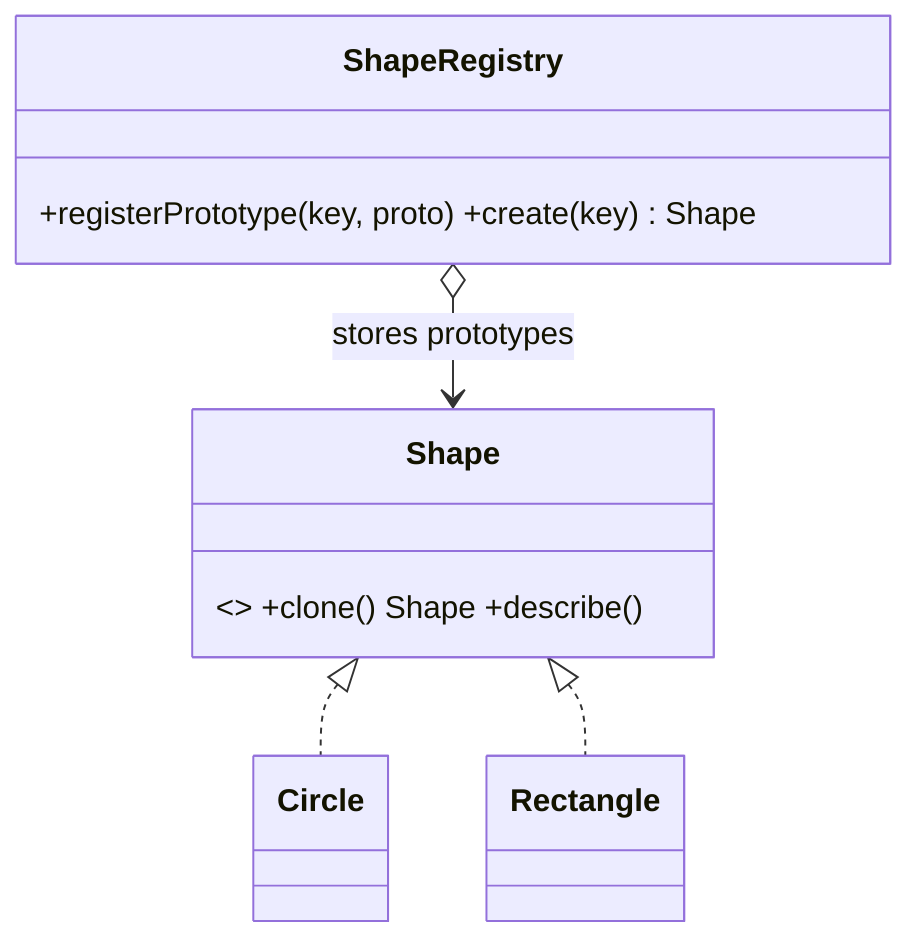

# Prototype

> **Section 06 — Design Patterns › Creational** · Code: [C++](C++%20Code/example.cpp) · [Java](Java%20Code/Main.java)

**Intent:** create new objects by **cloning** an existing, fully-configured instance instead of constructing from scratch. Great when construction is expensive, or when you want to copy an object's exact runtime configuration.

**Domain:** a drawing app. The user configures a shape (color, size) once, then stamps many copies via `clone()` — without re-specifying every property and without naming concrete classes.



- `clone()` copy-constructs the object, so the copy matches the original **exactly** (C++ uses the copy constructor; Java uses an explicit copy constructor via `cloneShape()`).
- A `ShapeRegistry` of ready-made prototypes is the common companion: ask for `"red-circle"`, get a fresh independent copy.

## How to run
```powershell
cd "06 - Design Patterns/Creational/Prototype/C++ Code"
g++ -std=c++14 example.cpp -o example.exe ; .\example.exe
```
```powershell
cd "06 - Design Patterns/Creational/Prototype/Java Code"
javac Main.java ; java Main
```

### Expected output (identical in C++ and Java)
```
  red circle (r=10)
  green circle (r=10)  (independent copy, recolored)
  blue rectangle (4x2)
```
