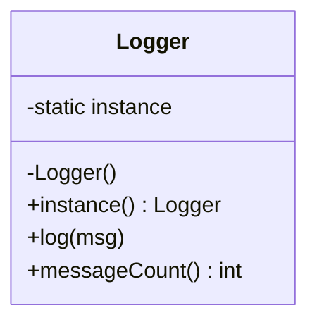

# Singleton

> **Section 06 — Design Patterns › Creational** · Code: [C++](C++%20Code/example.cpp) · [Java](Java%20Code/Main.java)

**Intent:** guarantee a class has exactly **one** instance and give the whole program a single access point to it. Use it for genuinely shared resources: a logger, a config store, a connection pool.

**Domain:** an app `Logger`. Different modules log through `Logger.instance()` — there is only ever one logger, and the message count is shared.



- **C++:** the *Meyers Singleton* — a function-local `static`. Since C++11 it is initialized exactly once, thread-safely, with zero locking code and no leak. Copy/assignment are `= delete`d.
- **Java:** an eager `private static final` instance (thread-safe by classloader guarantees) with a `private` constructor.

> **Use sparingly.** A Singleton is global state in disguise; it can hide dependencies and make testing harder. Reach for it only for a genuinely single, shared resource — otherwise inject the dependency (see [DIP](../../../05%20-%20SOLID%20Principles/Dependency%20Inversion%20Principle/Notes.md)).

## How to run
```powershell
cd "06 - Design Patterns/Creational/Singleton/C++ Code"
g++ -std=c++14 example.cpp -o example.exe ; .\example.exe
```
```powershell
cd "06 - Design Patterns/Creational/Singleton/Java Code"
javac Main.java ; java Main
```

### Expected output (identical in C++ and Java)
```
Same instance? yes
[LOG #1] application started
[LOG #2] charging Rs 799
[LOG #3] charging Rs 1499
[LOG #4] application shutting down
Total messages through the one Logger: 4
```
