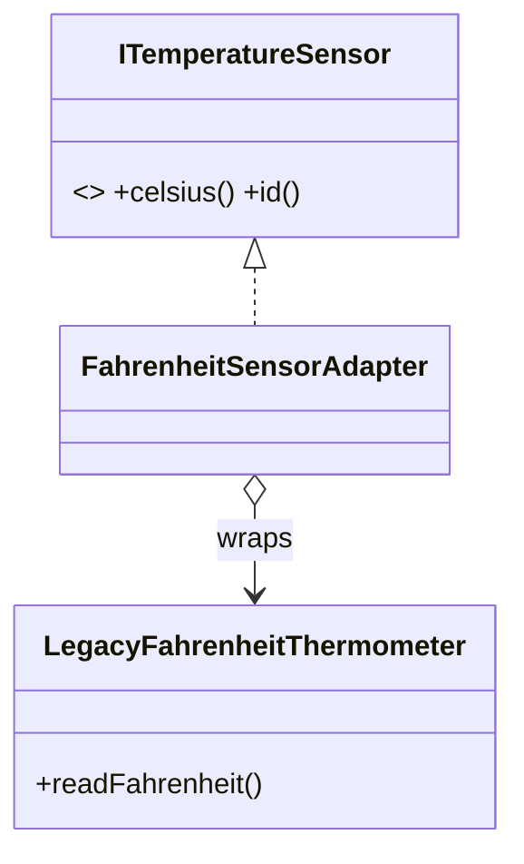

# Adapter

> **Section 06 — Design Patterns › Structural** · Code: [C++](C++%20Code/example.cpp) · [Java](Java%20Code/Main.java)

**Intent:** convert the interface of an existing class into another interface a client expects, so classes with incompatible interfaces can work together.

**Domain:** a weather dashboard speaks `ITemperatureSensor.celsius()`, but a third-party thermometer we can't modify only returns Fahrenheit. An adapter wraps it and translates.



- The adapter **implements the target** and **delegates** to the adaptee, doing the conversion (`(F-32)*5/9`).
- This is the *object adapter* (composition). The client never sees Fahrenheit.
- Section 09 applies Adapter to a real multi-gateway payment service.

## How to run
```powershell
cd "06 - Design Patterns/Structural/Adapter/C++ Code"
g++ -std=c++14 example.cpp -o example.exe ; .\example.exe
# Java: cd ../Java Code ; javac Main.java ; java Main
```

### Expected output
```
Weather dashboard (works only in Celsius):
  sensor TH-1007: 37 C
```
> (Java prints `37.0 C` — display only.)
