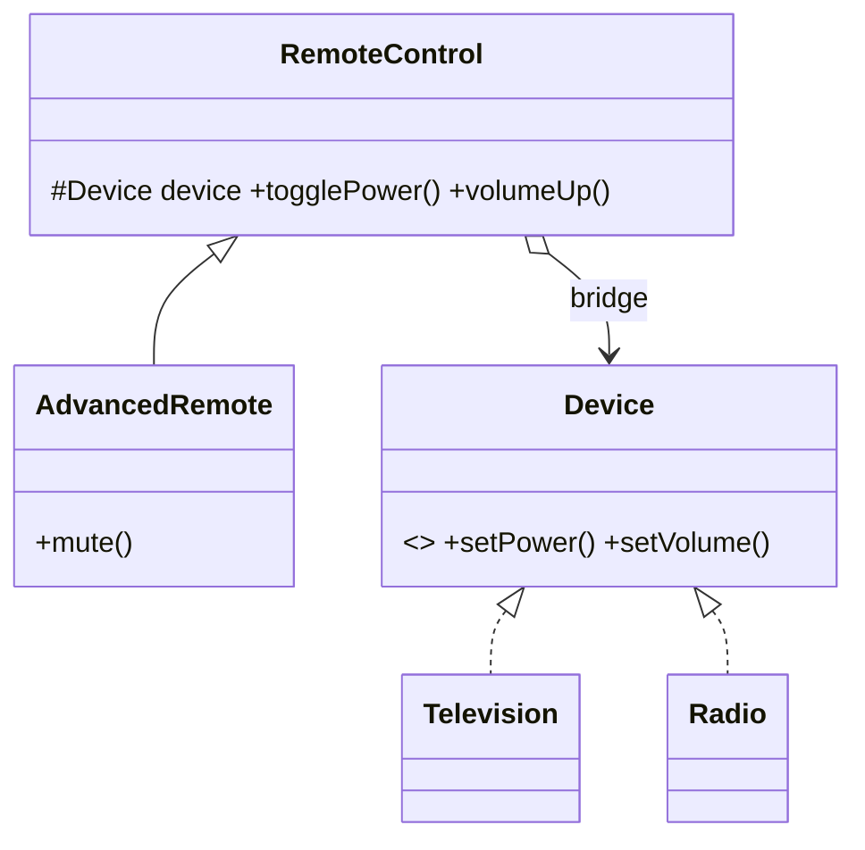

# Bridge

> **Section 06 — Design Patterns › Structural** · Code: [C++](C++%20Code/example.cpp) · [Java](Java%20Code/Main.java)

**Intent:** decouple an abstraction from its implementation so the two can vary **independently** — two hierarchies joined by a reference, instead of one exploding hierarchy.

**Domain:** remote controls (abstraction) operate devices (implementation). Without Bridge you'd need `BasicTVRemote`, `AdvancedTVRemote`, `BasicRadioRemote`… (M×N classes). With Bridge: M remotes + N devices, combined at runtime.



- The `Device` reference inside `RemoteControl` **is the bridge**.
- Add a remote type *or* a device type without touching the other side.

## How to run
```powershell
cd "06 - Design Patterns/Structural/Bridge/C++ Code"
g++ -std=c++14 example.cpp -o example.exe ; .\example.exe
# Java: cd ../Java Code ; javac Main.java ; java Main
```

### Expected output (identical in C++ and Java)
```
Basic remote + TV:
  TV is now ON
  TV volume = 30
Advanced remote + Radio (same remote class, different device):
  Radio is now ON
  Radio volume = 40
  Radio muted
```
