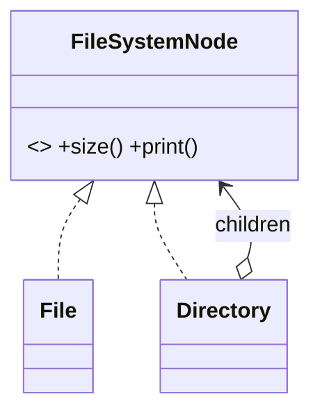

# Composite

> **Section 06 — Design Patterns › Structural** · Code: [C++](C++%20Code/example.cpp) · [Java](Java%20Code/Main.java)

**Intent:** compose objects into **tree** structures and let clients treat individual objects (leaves) and groups (composites) **uniformly** through one interface.

**Domain:** a file system. A `File` has a size; a `Directory` contains files and other directories. `size()` and `print()` work the same on a single file or the whole tree — no "is this a folder?" checks in client code.



- A composite implements each operation by **delegating to its children** (and recursing).
- The leaf/composite distinction is invisible to the client.

## How to run
```powershell
cd "06 - Design Patterns/Structural/Composite/C++ Code"
g++ -std=c++14 example.cpp -o example.exe ; .\example.exe
# Java: cd ../Java Code ; javac Main.java ; java Main
```
> The Java leaf class is named `FileNode` (to avoid clashing with `java.io.File`).

### Expected output (identical in C++ and Java)
```
+ project/ (43500 B total)
   - README.md (1200 B)
   + src/ (2300 B total)
      - main.cpp (800 B)
      - util.cpp (1500 B)
   + assets/ (40000 B total)
      - logo.png (40000 B)
Total project size: 43500 B
```
