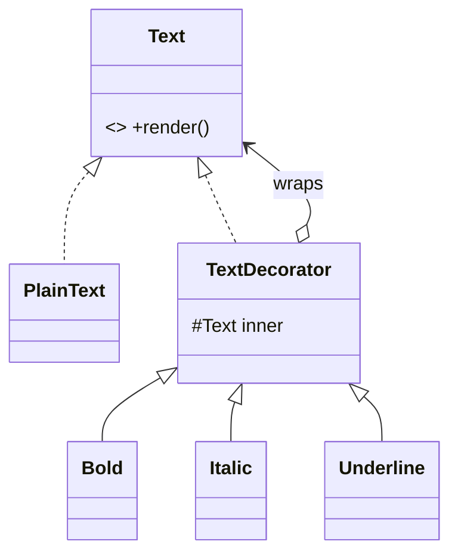

# Decorator

> **Section 06 — Design Patterns › Structural** · Code: [C++](C++%20Code/example.cpp) · [Java](Java%20Code/Main.java)

**Intent:** attach responsibilities to an object **dynamically** by wrapping it in another object that shares the same interface — a flexible alternative to subclassing.

**Domain:** rich-text rendering. A plain `Text` can be wrapped with `Bold`, `Italic`, `Underline` in any order/combination at runtime. Subclassing would need `BoldItalic`, `BoldUnderline`, `BoldItalicUnderline`… an explosion.



- Each decorator **is-a** `Text` and **has-a** `Text`; it calls the inner `render()` and adds its bit.
- Compose `Bold(Italic(PlainText))` at runtime — no new class per combination.
- Section 09 applies Decorator to a data-stream pipeline (compress + encrypt + encode).

## How to run
```powershell
cd "06 - Design Patterns/Structural/Decorator/C++ Code"
g++ -std=c++14 example.cpp -o example.exe ; .\example.exe
# Java: cd ../Java Code ; javac Main.java ; java Main
```

### Expected output (identical in C++ and Java)
```
  Sale!
  ***Sale!***
  <u>**50% OFF**</u>
```
