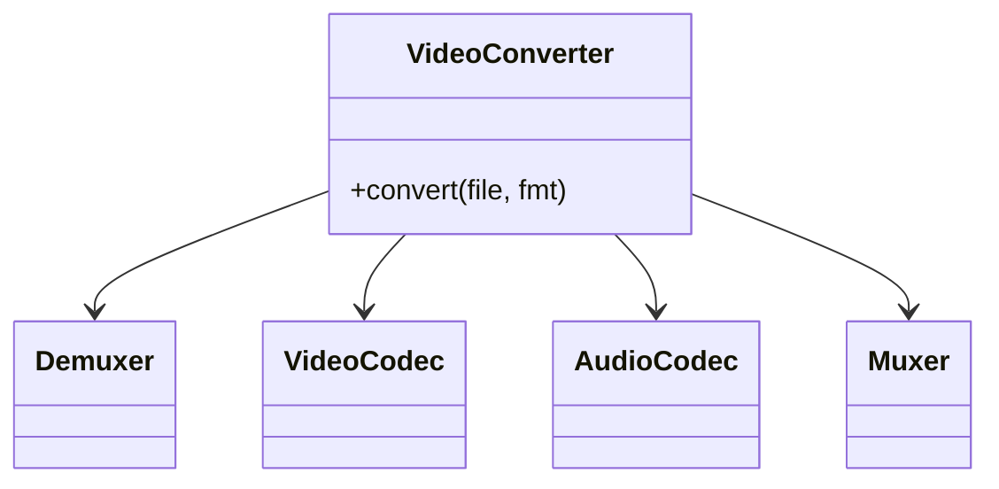

# Facade

> **Section 06 — Design Patterns › Structural** · Code: [C++](C++%20Code/example.cpp) · [Java](Java%20Code/Main.java)

**Intent:** provide a single, simplified interface to a complex subsystem. The facade orchestrates; clients get a one-call "front door" and never learn the subsystem's many classes.

**Domain:** converting a video touches a demuxer, a video codec, an audio codec, and a muxer. A `VideoConverter` facade exposes one `convert()` and hides the choreography.



- The facade **doesn't hide** the subsystem (you can still use it directly) — it just offers a convenient default path.
- Section 09 applies Facade to an e-commerce checkout (inventory + payment + shipping + notify).

## How to run
```powershell
cd "06 - Design Patterns/Structural/Facade/C++ Code"
g++ -std=c++14 example.cpp -o example.exe ; .\example.exe
# Java: cd ../Java Code ; javac Main.java ; java Main
```

### Expected output (identical in C++ and Java)
```
Converting holiday.mov -> mp4:
  [Demuxer] split holiday.mov into raw video + audio
  [VideoCodec] decode source frames
  [VideoCodec] encode frames to mp4
  [AudioCodec] transcode audio for mp4
  [Muxer] mux video+audio into holiday.mp4
Done -> holiday.mp4
```
