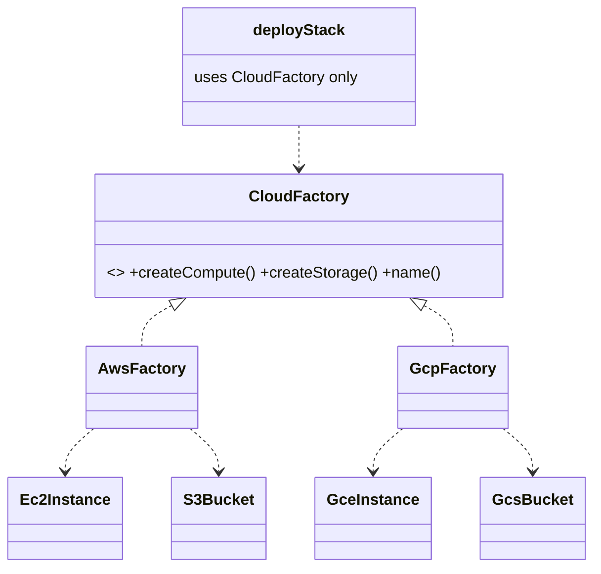

# Abstract Factory in a Real Project — Cloud Resource Families

> **Section 09 — Design Patterns in Real Projects** · Pattern: **Abstract Factory** · Code: [src/](src/)

Section 06 taught Abstract Factory with a focused example. **Here it earns its keep**: provisioning a whole infrastructure stack on whichever cloud you pick.

---

## The scenario
Your app can run on **AWS** or **GCP**. A "stack" needs **compute** + **storage**
that belong to the *same* provider — you must never pair an AWS EC2 instance with
a GCP storage bucket. **Abstract Factory** bundles a *family* of related products
behind one factory, so a whole stack is internally consistent by construction.

## The design


- Each **concrete factory** produces one coherent family (`Ec2`+`S3`, or `Gce`+`Gcs`).
- The client `deployStack(factory)` only knows the **abstract** factory — swap AWS
  for GCP by passing a different factory.

## Project layout
```
src/
  factories.js   the two product families + AwsFactory / GcpFactory
  index.js       deployStack (client) + the demo
```

## How to run
```powershell
cd "09 - Design Patterns in Real Projects/Abstract Factory - Cloud Resources"
node src/index.js
```
### Expected output
```
Deploying stack on AWS:
  compute -> EC2 t3.medium instance
  storage -> S3 bucket
Deploying stack on GCP:
  compute -> GCE e2-medium instance
  storage -> GCS bucket
```

## Factory Method vs Abstract Factory
**Factory Method** makes *one* product via a subclass hook. **Abstract Factory**
makes a *family* of related products that must stay consistent. Adding **Azure**
here = one new factory producing `AzureVm` + `BlobStorage`; `deployStack` never changes.
