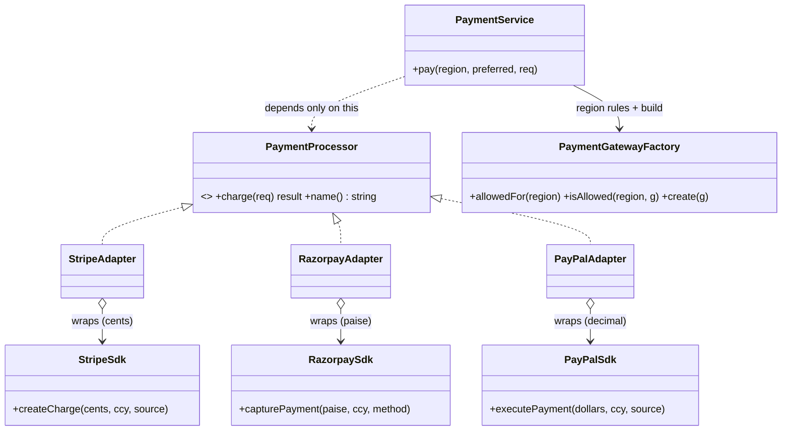

# Adapter in a Real Project — a Multi-Region Payment Service

> **Section 09 — Design Patterns in Real Projects** · Pattern: **Adapter** (+ Factory, + region policy, + fallback) · Code: [src/](src/)

Section 06 taught Adapter with a focused example. **Here it earns its keep** in a production-flavoured Node.js service — the kind of code you'd actually ship.

---

## The scenario

You're building the **payment service** for a product that serves customers across regions:

- Each region permits **different gateways**. India is dominated by **Razorpay/UPI**; the US/EU lean on **Stripe** and **PayPal**.
- Each gateway is a **third-party SDK you don't own and can't change**, and they're all *different*:
  - **Stripe** wants the amount in **minor units (cents)** and returns a result object.
  - **Razorpay** wants **paise** and returns a `status=...;id=...` string.
  - **PayPal** wants a **decimal amount in major units (dollars)** as a float.

Your `PaymentService` must **not** be polluted with `if (gateway == 'stripe') … else if …` and unit conversions everywhere. It should speak **one** language and let an adapter per gateway do the translating.

> This is exactly where **Adapter** fits: make each incompatible SDK conform to one interface your code already understands.

## The design



- **`PaymentService`** depends *only* on `PaymentProcessor`. It never sees a cent, a paisa, or a PayPal dollar.
- Each **Adapter** owns one job: translate our request into its SDK's shape and the reply back into our result.
- **`PaymentGatewayFactory`** holds the **region → allowed gateways** policy (as data) and builds the right adapter.

## Project layout (a small, real Node project)
```
src/
  money.js        Region, GatewayId, integer-money helper, result helpers
  processors.js   PaymentProcessor interface + 3 SDKs (adaptees) + 3 adapters
  factory.js      PaymentGatewayFactory (region policy + create)
  service.js      PaymentService (depends only on the interface)
  index.js        the demo (three scenarios)
```

## What makes it production-flavoured (not a toy)
- **Integer money.** Amounts live in **minor units**, never `float` — floats silently lose precision on money. Only the PayPal adapter converts to a decimal.
- **Region policy as data**, not `if`-statements → adding a region/gateway is a one-line change.
- **Graceful fallback** when the preferred gateway isn't allowed in a region.
- **Typed results** (`success` / `transactionId` / `gateway` / `error`) — no exceptions for control flow.
- **Idempotency key** on every request, as real gateways require, so a retry doesn't double-charge.

> **Retryable vs terminal:** the demo loops to the next gateway on any failure, but in production you only fail over on **transient** errors (timeout/5xx). A **hard decline** (insufficient funds, fraud) must *not* be retried on another gateway. Scenario 3 shows a hard decline correctly ending in failure.

## How to run
```powershell
cd "09 - Design Patterns in Real Projects/Adapter - Payment Gateways"
node src/index.js
```

### Expected output
```
[PaymentService] cust_in_01 in India paying 499 INR (prefers Razorpay)
  -> attempting via Razorpay:
    (Razorpay SDK) capture 49900 INR paise via upi
  OK  Razorpay txn=pay_49900

[PaymentService] cust_us_02 in USA paying 19.99 USD (prefers Razorpay)
  ! Razorpay is not permitted in USA - using an allowed gateway instead
  -> attempting via Stripe:
    (Stripe SDK) createCharge 1999 USD cents
  OK  Stripe txn=ch_1999

[PaymentService] cust_eu_03 in Europe paying 80.5 EUR (prefers PayPal)
  -> attempting via PayPal:
    (PayPal SDK) executePayment 80.5 EUR
  X   PayPal: payment FAILED - trying next gateway
  -> attempting via Stripe:
    (Stripe SDK) createCharge 8050 EUR cents
  X   Stripe: card_declined - trying next gateway
  FAILED on all gateways
```

## Key takeaway
New gateway (say **PhonePe**) = write **one** `PhonePeAdapter` + add it to the region policy. `PaymentService` doesn't change — that's the **Open/Closed Principle**, delivered by Adapter.
