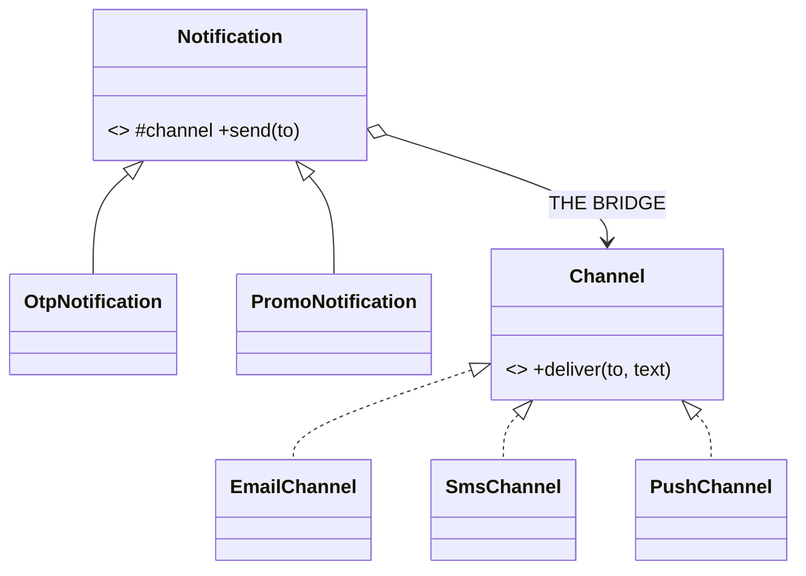

# Bridge in a Real Project — Notification Type × Channel

> **Section 09 — Design Patterns in Real Projects** · Pattern: **Bridge** · Code: [src/](src/)

Section 06 taught Bridge with a focused example. **Here it earns its keep**: notifications that vary along *two* axes at once.

---

## The scenario
You have notification **types** (OTP, Promo, Alert, …) and delivery **channels**
(Email, SMS, Push, …). If you subclass every combination you get
`OtpEmail`, `OtpSms`, `PromoEmail`, `PromoSms`, … — an **M×N explosion**.

**Bridge** splits the two axes: an *abstraction* hierarchy (the notification
type) holds a reference to an *implementor* (the channel). Now you have M + N
classes instead of M × N, and any type pairs with any channel at runtime.

## The design


The composition arrow (`Notification o--> Channel`) **is** the bridge.

## Project layout
```
src/
  channels.js        the implementor side (Email / SMS / Push)
  notifications.js   the abstraction side (Otp / Promo)
  index.js           the demo (mix types and channels freely)
```

## How to run
```powershell
cd "09 - Design Patterns in Real Projects/Bridge - Notification Channels"
node src/index.js
```
### Expected output
```
Any notification type over any channel (mixed at runtime):
    [sms -> +91-90000-0001] Your OTP is 4827. Do not share it.
    [push -> device-9] Your OTP is 1234. Do not share it.
    [email -> a@x.com] Limited offer: 50% off shoes 🎉
```

## Bridge vs Strategy
They look similar (both compose an object). **Strategy** swaps *one* algorithm.
**Bridge** is structural: it lets **two hierarchies** (type and channel) evolve
independently. Add a `WhatsAppChannel` *or* an `AlertNotification` — each is one
class, and every existing combination keeps working.
