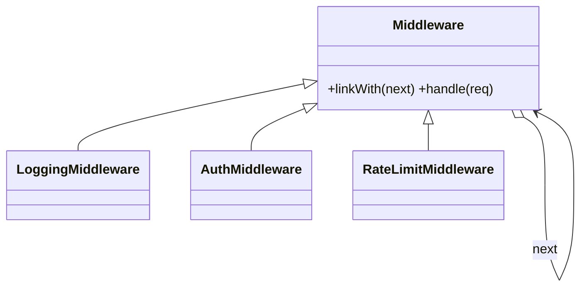

# Chain of Responsibility in a Real Project — HTTP Middleware

> **Section 09 — Design Patterns in Real Projects** · Pattern: **Chain of Responsibility** · Code: [src/](src/)

Section 06 taught Chain of Responsibility with a focused example. **Here it earns its keep**: it's literally how Express/Koa middleware works.

---

## The scenario
Every HTTP request should pass through **logging → auth → rate-limiting** before
hitting your handler. Each stage may **pass it on** or **stop it cold** (401, 429).
You want to add, remove, or reorder stages without touching the others.

**Chain of Responsibility** links handlers; a request flows down the chain until
one handles (terminates) it or it reaches the end (200).

## The design


`handle()` either returns a response (short-circuit) or calls `super.handle()` to
forward — `linkWith()` wires the chain and returns the next link so wiring chains.

## Project layout
```
src/
  middleware.js   Middleware base + Logging / Auth / RateLimit
  index.js        build the chain + four requests
```

## How to run
```powershell
cd "09 - Design Patterns in Real Projects/Chain of Responsibility - HTTP Middleware"
node src/index.js
```
### Expected output
```
1) Authorized request:
  [log] GET /orders from clientX
  [auth] ok
  [ratelimit] clientX 1/2
  => 200 OK: handled /orders

2) Missing token (blocked at auth):
  [log] GET /orders from clientY
  [auth] reject -> 401
  => 401 Unauthorized

3) Authorized again (clientX 2/2):
  [log] GET /orders from clientX
  [auth] ok
  [ratelimit] clientX 2/2
  => 200 OK: handled /orders

4) Authorized again (clientX over quota):
  [log] GET /orders from clientX
  [auth] ok
  [ratelimit] clientX over quota -> 429
  => 429 Too Many Requests
```

## Key takeaway
Request 2 dies at **auth** (never reaches rate-limit); request 4 dies at
**rate-limit**. Each handler is independent and reorderable — that's why this is
the backbone of every web framework's middleware stack.
