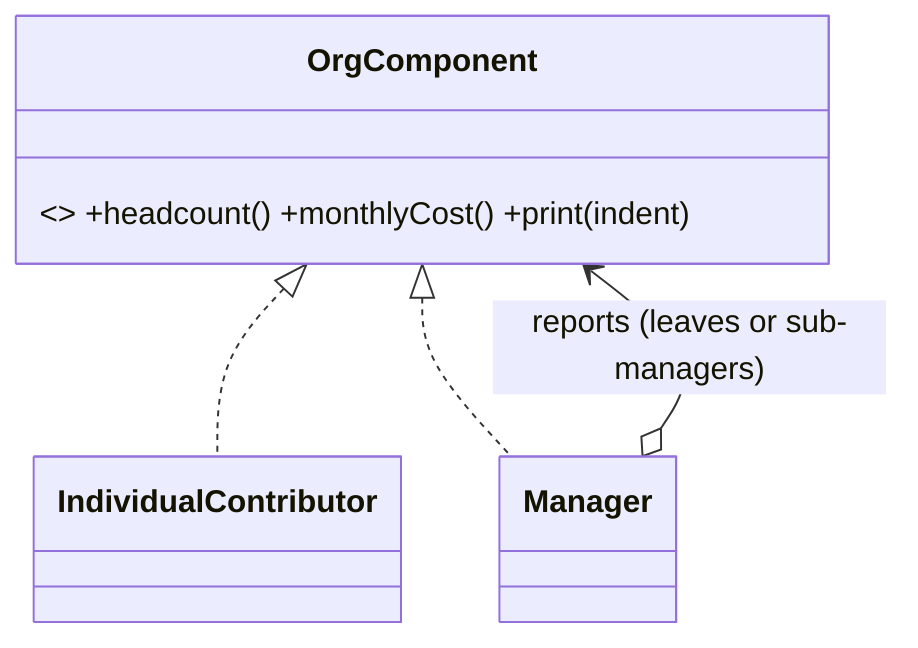

# Composite in a Real Project — Organization Chart

> **Section 09 — Design Patterns in Real Projects** · Pattern: **Composite** · Code: [src/](src/)

Section 06 taught Composite with a focused example. **Here it earns its keep**: rolling up headcount and cost across an org tree.

---

## The scenario
An org is a tree: a **manager** has reports, who may be **individual
contributors** *or* other managers. You want "total headcount" and "total monthly
cost" for any sub-tree — and you don't want the caller to branch on *"is this a
leaf or a manager?"* at every step.

**Composite** gives leaves and composites the **same interface**
(`headcount`, `monthlyCost`, `print`), so a manager simply sums its reports —
each of which answers the same questions recursively.

## The design


## Project layout
```
src/
  org.js     IndividualContributor (leaf) + Manager (composite)
  index.js   the demo (builds a 3-level org, totals the whole tree)
```

## How to run
```powershell
cd "09 - Design Patterns in Real Projects/Composite - Org Chart"
node src/index.js
```
### Expected output
```
+ Asha (CTO) (Rs 500000) - team of 6, cost Rs 1570000
   + Ravi (Eng Mgr) (Rs 300000) - team of 3, cost Rs 610000
      - Dev A (Rs 150000)
      - Dev B (Rs 160000)
   + Meera (Data Mgr) (Rs 320000) - team of 2, cost Rs 460000
      - Analyst (Rs 140000)
Org headcount: 6, total monthly cost: Rs 1570000
```

## Key takeaway
`cto.monthlyCost()` recurses the whole subtree with **no type checks** — the leaf
and the composite each just answer for themselves. The same shape powers file
systems, UI trees, and BOMs. (This is the structural sibling of the **Amazon
catalog** in section 08, which is also a Composite.)
