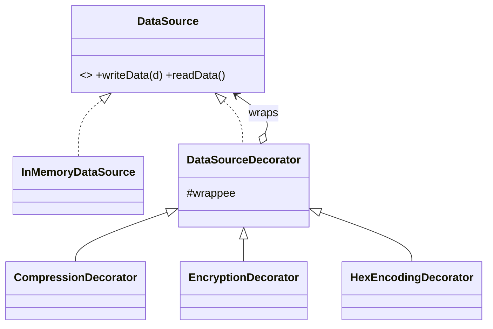

# Decorator in a Real Project — a Data-Stream Pipeline

> **Section 09 — Design Patterns in Real Projects** · Pattern: **Decorator** · Code: [src/](src/)

Section 06 taught Decorator with a focused example. **Here it earns its keep**: a write pipeline that compresses, encrypts, and encodes — each layer optional and reorderable.

---

## The scenario
Before bytes hit storage you often want to **compress**, then **encrypt**, then
**encode** them — and read them back through the inverse chain. You don't want a
`CompressedEncryptedEncodedDataSource` class for every combination.

**Decorator** wraps a `DataSource` in layers. Each layer transforms on `write`
and applies the inverse on `read`, delegating to the layer it wraps. Stack them
in any order; each is independent.

## The design


Writing flows **outside-in** (compress → encrypt → encode → store); reading
unwinds the same stack to return the original bytes.

## Project layout
```
src/
  dataSource.js   InMemoryDataSource + base decorator + 3 transforms
  index.js        the demo (write through the stack, read back, verify round-trip)
```

## How to run
```powershell
cd "09 - Design Patterns in Real Projects/Decorator - Data Stream Pipeline"
node src/index.js
```
### Expected output
```
Writing: "aaaabbbcccccd"
  [stored bytes] 6434653366356731
Read back: "aaaabbbcccccd"
Round-trip OK
```
The stored bytes are unreadable (compressed → Caesar-shifted → hex), yet the read
path reconstructs the original exactly.

## Key takeaway
Each concern (compression, encryption, encoding) is **one small class** you can
add, remove, or reorder. That's Decorator — behaviour composed at runtime instead
of frozen into a subclass. (Swiggy's menu add-ons in section 08 are the same idea.)
