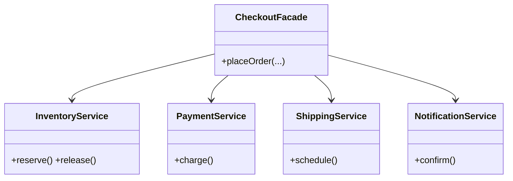

# Facade in a Real Project — E-commerce Checkout

> **Section 09 — Design Patterns in Real Projects** · Pattern: **Facade** · Code: [src/](src/)

Section 06 taught Facade with a focused example. **Here it earns its keep**: one `placeOrder()` over four messy subsystems.

---

## The scenario
Placing an order touches **inventory**, **payment**, **shipping**, and
**notifications** — in a specific order, with rollback if a step fails. You don't
want every caller (web, mobile, admin) re-implementing that dance.

**Facade** gives one simple front door (`placeOrder`) that hides the subsystems
and their orchestration. The subsystems stay independent and testable.

## The design


The key bit of "real": if payment fails **after** stock was reserved, the facade
**releases** the reservation (rollback) — that orchestration is exactly what a
facade is for.

## Project layout
```
src/
  services.js         the four subsystems
  checkoutFacade.js   the Facade (orchestration + rollback)
  index.js            the demo (happy path, out-of-stock, declined+rollback)
```

## How to run
```powershell
cd "09 - Design Patterns in Real Projects/Facade - Checkout"
node src/index.js
```
### Expected output
```
placeOrder(Aarav, 1x BOOK-42):
    [inventory] reserved 1 x BOOK-42
    [payment] charging Aarav Rs 499 -> OK
    [shipping] scheduled to 12 MG Road
    [notify] Aarav: order confirmed, track TRK1
  => order placed

placeOrder(Bhavna, 1x BOOK-42):
    [inventory] insufficient stock of BOOK-42
  => order failed

placeOrder(Chetan, 2x PEN-7):
    [inventory] reserved 2 x PEN-7
    [payment] charging Chetan Rs 80 -> DECLINED
    [inventory] released 2 x PEN-7 (rollback)
  => order failed
```

## Facade vs the giant-system facades
Every section-08 system has a Facade (`SwiggyApp`, `UberApp`, …). This one is the
pattern in isolation: a thin front door **delegating** to subsystems — it adds no
logic of its own beyond sequencing and rollback.
