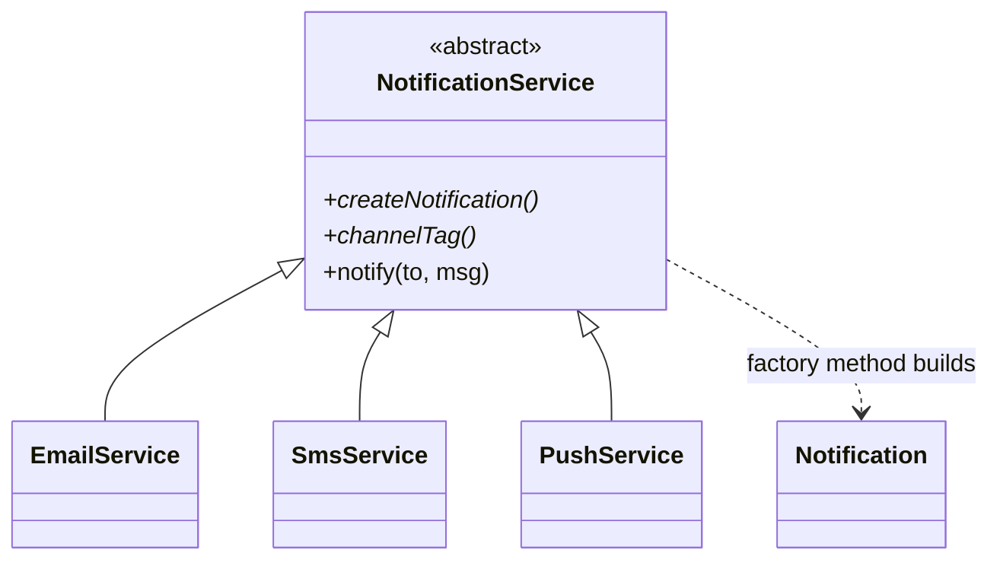

# Factory Method in a Real Project — Notification Senders

> **Section 09 — Design Patterns in Real Projects** · Pattern: **Factory Method** · Code: [src/](src/)

Section 06 taught Factory Method with a focused example. **Here it earns its keep**: a notification service that delivers on each user's preferred channel.

---

## The scenario
Every product sends notifications — *"your order shipped"*, OTPs, alerts — over
**email, SMS, or push**. The *message and workflow* are the same; only the
**transport** differs. You don't want `if (channel == 'sms') … else if …`
sprinkled through the codebase.

**Factory Method** lets a base `NotificationService` own the shared `notify()`
workflow while deferring *which* notification object to build to subclasses.

## The design


- `notify()` is the **shared workflow** (tag the message, then send).
- `createNotification()` is the **factory method** each subclass overrides.

## Project layout
```
src/
  senders.js   products + NotificationService + concrete creators + serviceFor()
  index.js     the demo
```

## How to run
```powershell
cd "09 - Design Patterns in Real Projects/Factory Method - Notification Senders"
node src/index.js
```
### Expected output
```
Sending 'Your order shipped' on each user's preferred channel:
    [email -> aarav@mail.com] [EMAIL] Your order shipped
    [sms -> +91-90000-0001] [SMS] Your order shipped
    [push -> device-token-9] [PUSH] Your order shipped
```

## Key takeaway
A new channel (WhatsApp) = **one new product + one new creator**; the `notify()`
workflow and every caller stay untouched. That's Factory Method delivering the
Open/Closed Principle.
