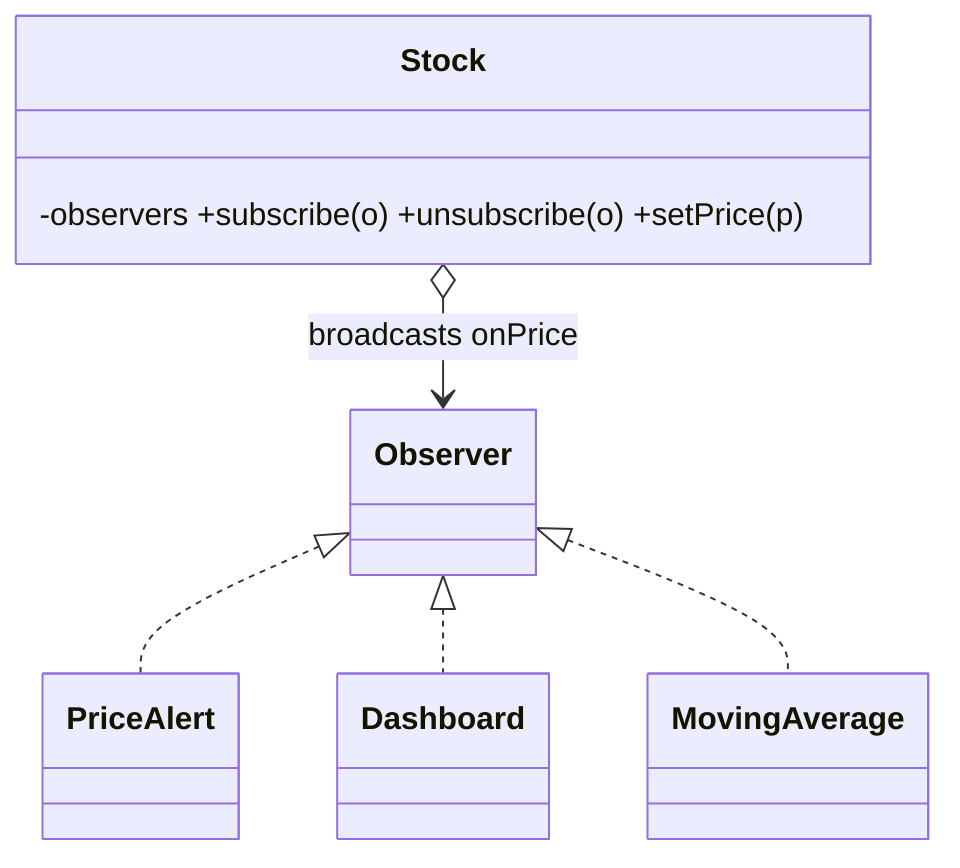

# Observer in a Real Project — Live Stock Ticker

> **Section 09 — Design Patterns in Real Projects** · Pattern: **Observer** · Code: [src/](src/)

Section 06 taught Observer with a focused example. **Here it earns its keep**: many independent widgets reacting to a live price feed.

---

## The scenario
A stock's price updates constantly, and **many** things care: a dashboard, a
moving-average calculator, per-user price alerts. They come and go (a user closes
the app). The price source shouldn't know or hard-code who's listening.

**Observer** lets the `Stock` (subject) keep a list of subscribers and broadcast
each price change. Observers are duck-typed — anything with `onPrice` can join —
and can **unsubscribe** at any time.

## The design


## Project layout
```
src/
  stock.js   Stock (subject) + PriceAlert / Dashboard / MovingAverage (observers)
  index.js   subscribe three, push ticks, unsubscribe one
```

## How to run
```powershell
cd "09 - Design Patterns in Real Projects/Observer - Stock Ticker"
node src/index.js
```
### Expected output
```
INFY @ Rs 1500
    [dashboard] tick INFY=1500
    [SMA] avg over 1 ticks = 1500
INFY @ Rs 1508
    [dashboard] tick INFY=1508
    [SMA] avg over 2 ticks = 1504
INFY @ Rs 1512
    [dashboard] tick INFY=1512
    [SMA] avg over 3 ticks = 1506.6666666666667
    [alert -> Aarav] INFY crossed Rs 1510 (now 1512)
Aarav closes the app (unsubscribes):
INFY @ Rs 1520
    [dashboard] tick INFY=1520
    [SMA] avg over 4 ticks = 1510
```

## Key takeaway
After Aarav **unsubscribes**, the `1520` tick fires no alert — the subject simply
dropped him from its list. New widget types need zero changes to `Stock`. (This is
the same pattern powering Cricbuzz, Zerodha, and the Amazon order events in
sections 07–08.) The long SMA decimal is just JS float formatting.
