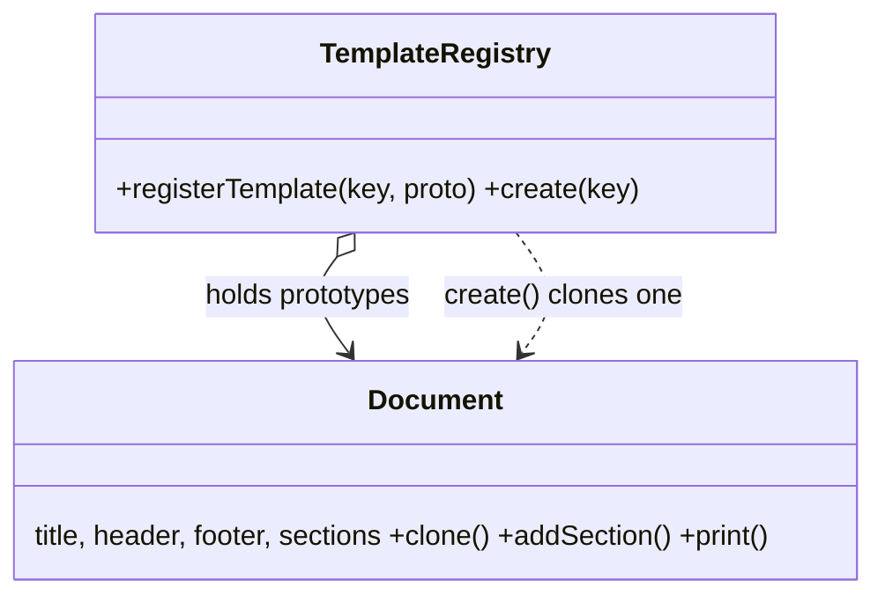

# Prototype in a Real Project — Document Template Registry

> **Section 09 — Design Patterns in Real Projects** · Pattern: **Prototype** · Code: [src/](src/)

Section 06 taught Prototype with a focused example. **Here it earns its keep**: stamping out invoices/reports from pre-built templates.

---

## The scenario
Documents (invoices, reports, contracts) share a lot of boilerplate — header,
footer, standard sections. Re-building each one field-by-field is wasteful and
error-prone. **Prototype** registers fully-formed templates once, then **clones**
one whenever you need a fresh document to customise.

The subtlety that makes it real: the clone must be a **deep copy** of the mutable
parts (the `sections` array), or editing one document silently mutates the
template and every future clone.

## The design


## Project layout
```
src/
  document.js   Document (with clone) + TemplateRegistry
  index.js      the demo
```

## How to run
```powershell
cd "09 - Design Patterns in Real Projects/Prototype - Document Templates"
node src/index.js
```
### Expected output
```
Invoice 1 (cloned + edited):
  == INVOICE #1001 ==
  Acme Corp - Tax Invoice
    * Bill To: ____
    * Item: Widget x2 - Rs 400
  Thank you!
Invoice 2 (independent clone - no leftover items from inv1):
  == INVOICE #1002 ==
  Acme Corp - Tax Invoice
    * Bill To: ____
  Thank you!
```

## Key takeaway
Invoice 2 has **only** the template's `Bill To` section — none of Invoice 1's
edits leaked in. That independence (the deep clone) is the entire point of
Prototype. Cloning a ready object also beats re-running expensive construction.
