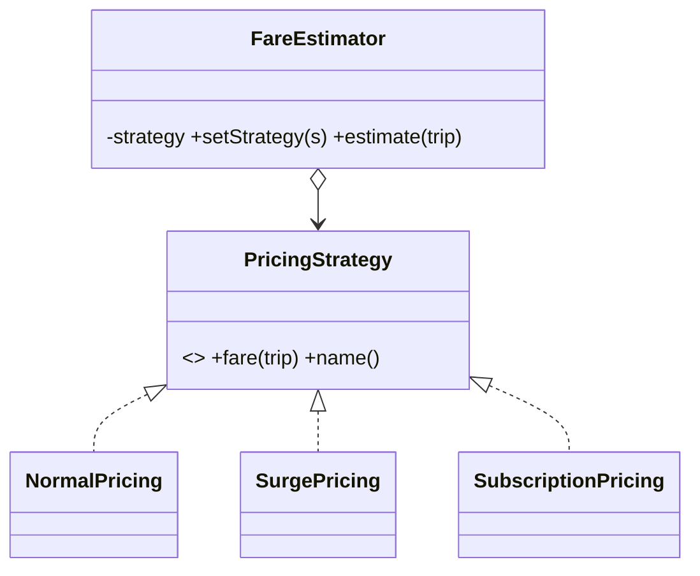

# Strategy in a Real Project — Dynamic Ride Pricing

> **Section 09 — Design Patterns in Real Projects** · Pattern: **Strategy** · Code: [src/](src/)

Section 06 taught Strategy with a focused example. **Here it earns its keep**: pricing a ride differently by context (normal / surge / member).

---

## The scenario
The fare for a trip depends on a **policy** that changes: normal metered fare,
**surge** during peak demand, or a discounted **subscription** rate for members.
The estimator shouldn't be a tangle of `if (surge) … else if (member) …`.

**Strategy** makes each pricing policy its own class behind a `fare(trip)` +
`name()` contract. The estimator holds one and can swap it at runtime.

## The design


## Project layout
```
src/
  pricing.js   the meter + Normal / Surge / Subscription strategies + FareEstimator
  index.js     price one trip three ways
```

## How to run
```powershell
cd "09 - Design Patterns in Real Projects/Strategy - Dynamic Pricing"
node src/index.js
```
### Expected output
```
Pricing the same trip (8 km, 22 min):
  Normal: Rs 159
  Surge x1.8: Rs 286.2
  Subscription (member): Rs 116.10000000000001
```
> The long decimal on the subscription fare is just IEEE-754 float formatting
> (`129 * 0.9`); a real app would round for display.

## Key takeaway
The estimator never changes — adding a "night discount" policy is **one new
class**. Strategy is the most-used pattern in this whole course (Parking Lot,
Splitwise, Uber, Netflix, …) precisely because "the part that varies = a policy
object" is everywhere.
