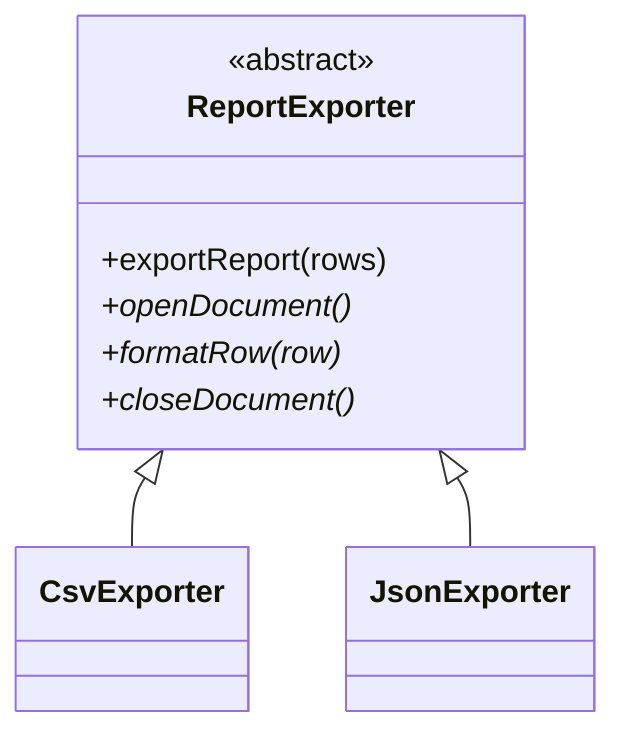

# Template Method in a Real Project — Report Export Pipeline

> **Section 09 — Design Patterns in Real Projects** · Pattern: **Template Method** · Code: [src/](src/)

Section 06 taught Template Method with a focused example. **Here it earns its keep**: exporting the same report to CSV or JSON.

---

## The scenario
Exporting a report always follows the same skeleton — **open** the document,
**format each row**, **close** the document. Only the *details* of each step differ
per format (CSV vs JSON). You don't want to duplicate the loop-and-assemble logic
in every exporter.

**Template Method** puts the fixed skeleton in a base-class method
(`exportReport`) that calls overridable steps (`openDocument`, `formatRow`,
`closeDocument`). Subclasses fill in only what varies.

## The design


`exportReport()` is the **template method** — it owns the algorithm's shape and is
*not* overridden; the `*` steps are the hooks subclasses implement.

## Project layout
```
src/
  exporters.js   ReportExporter (skeleton) + CsvExporter + JsonExporter
  index.js       export the same rows as CSV and JSON
```

## How to run
```powershell
cd "09 - Design Patterns in Real Projects/Template Method - Report Export"
node src/index.js
```
### Expected output
```
CSV:
id,name,amount
1,Widget,400
2,Gadget,750

JSON:
[
  {"id": "1", "name": "Widget", "amount": "400"},
  {"id": "2", "name": "Gadget", "amount": "750"}
]
```

## Template Method vs Strategy
Both let a step vary, but **Template Method uses inheritance** (the skeleton calls
down to subclass hooks) while **Strategy uses composition** (the context holds a
swappable object). Reach for Template Method when the *overall algorithm* is fixed
and only a few steps differ — like this export pipeline.
